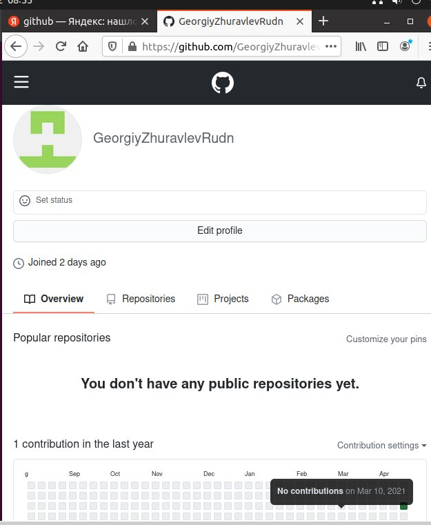
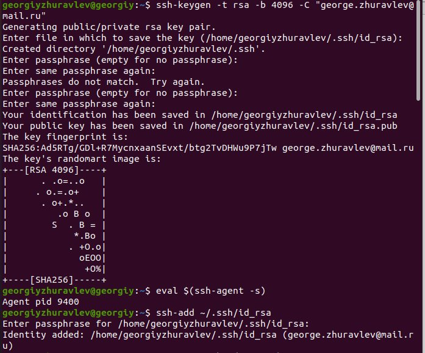
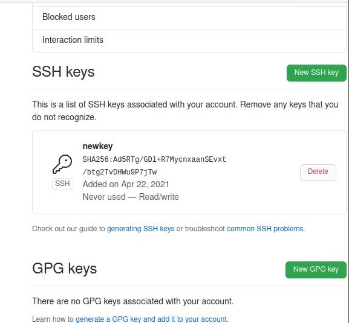
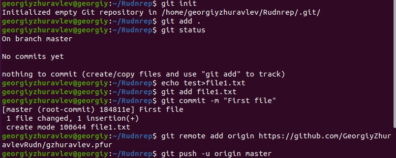
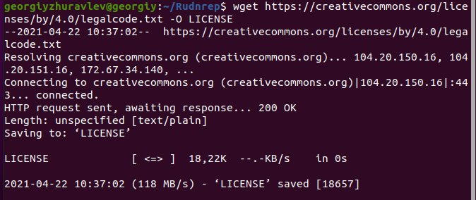
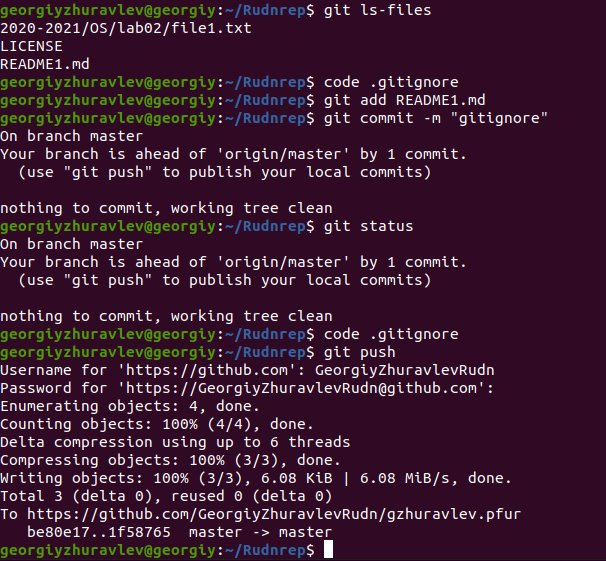
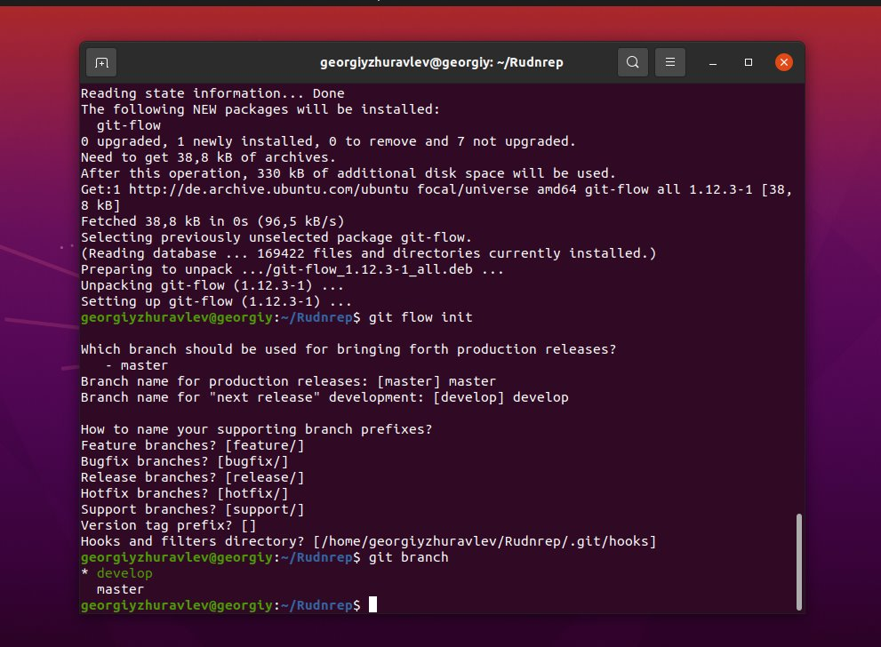
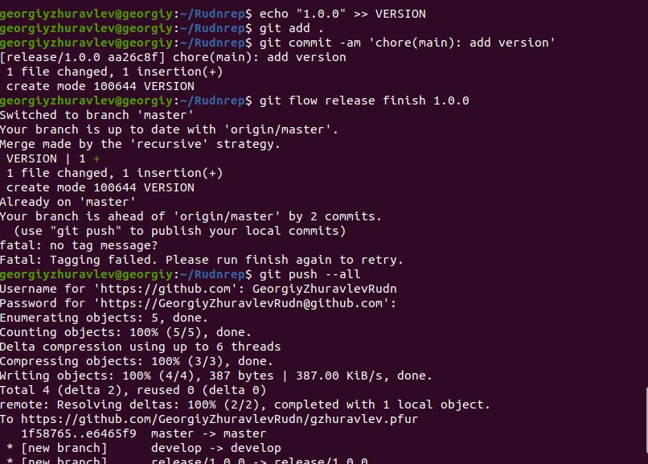
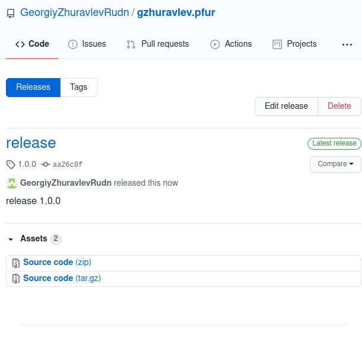
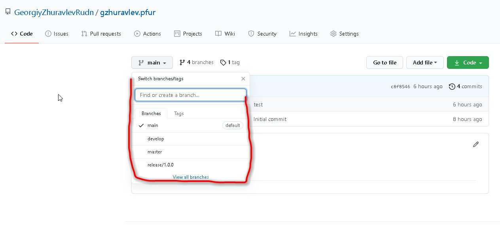

# Цель работы
Получить опыт работы с Git. Создать аккаунт; подключить  репозиторий к Github; Пройти первичную конфигурацию; провести конфигурацию git-flow.

# Задание

* Сделать отчет по предыдущей работе в формате Markdown.

* Предоставить в 3-х форматах: pdf, md and docx.

# Выполнение лабораторной работы

### 1. Создаем аккаунт github

### 2. Генерируем ключ для настройки VCS.

### 3. Добавляем сгенерированный ключ.

### 4. Приступаем к созданию репозитория и файлов.

### 5. Добавляем лицензию

### 6. Добавляем игнорируемый файл ( с помощью vs code).

### 7. Инициализируем git flow.

### 8. Добавляем релиз и загружаем на Github.

### 9. Получившиеся  результаты(ветви + данные).

# Вывод

Благодаря этой лабораторной работе, я научился: создавать репозитории, создавать файлы и проходить процесс подтверждения, загружать файлы в репозиторий git,  делать релизы и создавать ветви.

# Контрольные вопросы

1. VCS – ПО для облегчения работы с изменяющиеся информацией(хранит изменяющиеся версии; может быть изменена разными людьми, если проходит работа над совместным проектом). VCS предназначена для удобства использования в проектах, например один человек написал некоторый код, который хочет поместить в основную ветвь проекта, его коллеги могут проверить и сделать заметки в виде комментариев.

2. Хранилище – основное место хранения; Commit – подтверждение всех изменений и тп., для дальнейшей загрузки в репозиторий; History – история изменения; Рабочая копия – действительные папка с файлами.
3. Централизованные системы контроля  представляют собой приложения типа клиент-сервер;( 1 основной репозиторий)(SVN)
Распределенные системы контроля версий  позволяют хранить репозиторий (его копию) у каждого разработчика, работающего с данной системой.( множество репозиториев, взаимодействующих с сервером)(Git)

4. Создание репозитория ~> создание/добавление файлов в локальную файловую систему ~> добавление в локальный репозиторий ~> подтверждение добавления ~> загрузка в онлайн репозиторий.

5. -
6. -

7. Git add – adds a file to the staging area; git commit- opens chosen git editor or git commit -m “message”(commitment with a message); git push – pushes files to repository; git pull – downloads/ changes files from repository; git branch – shows branches; git status – status of your  process; git  rm “”- removes a file/es;  and so on.

8. Создание файла в репозитории( лок.); загрузка файлов на удалённый репозиторий(удал.)

9. Ветви – специальные разделения дерева, которые нужны для удобства использования git, например для дальнейшего merg’a.

10.  “git editor”.gitignore ~>git add .gitignore~>git commit; Игнорирование нужно для исключения ненужных файлов/ файловых систем/ тп. из области работы.
