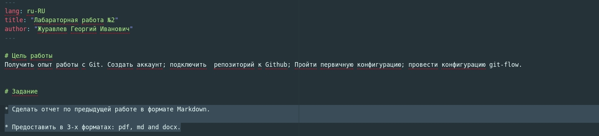
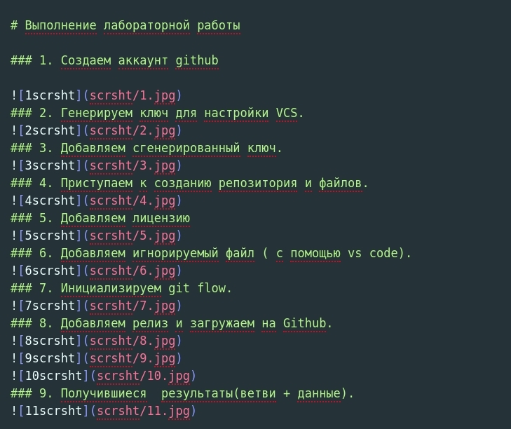
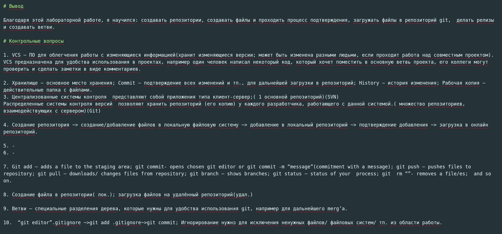

# Цель работы
* Сделать отчет по предыдущей работе в формате Markdown.

* Предоставить в 3-х форматах: pdf, md and docx.

# Выполнение лабораторной работы

### 1. Заполняем отчет в формате Markdown

### 2. Конвертируем отчет в форматы pdf and docx

# Вывод

Благодаря этой лабораторной работе, я научился: работать с markdown, конвертировать файлы в другие форматы.
