# Цель работы
Приобретение практических навыков взаимодействия пользователя с системой посредством командной строки.

# Задание

* Сделать отчет по предыдущей работе в формате Markdown.

* Предоставить в 3-х форматах: pdf, md and docx.

# Выполнение лабораторной работы

### 1. Определяем полное имя каталога

        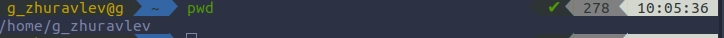

### 2. Переходим в каталог /tmp

        2.1. Выводим содержимое
        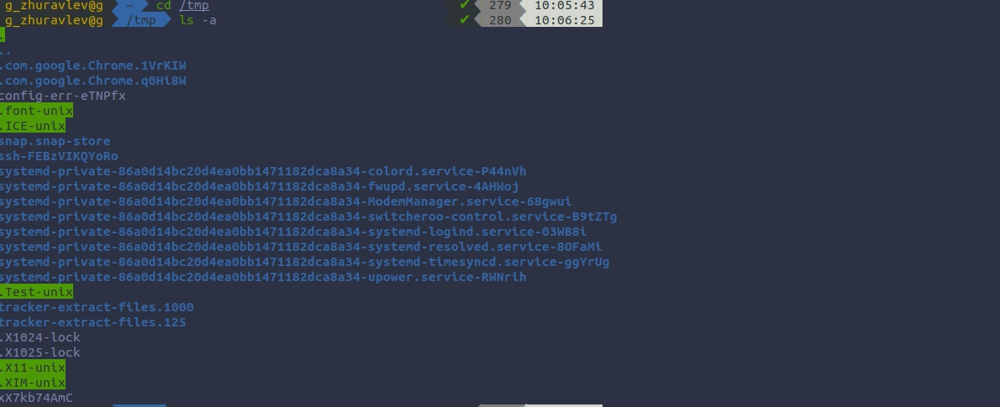
        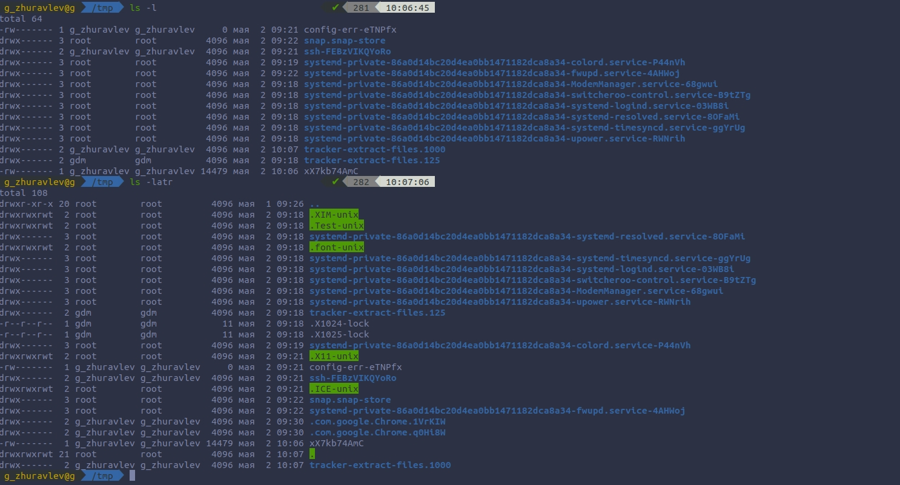

        2.2. Определяем есть ли в каталоге  /var/spool подкаталог с именем cron
        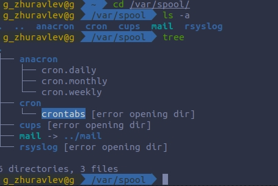
        Вывод: Да, есть.

        2.3. Переходим в домашний каталог  и выводим содержимое
        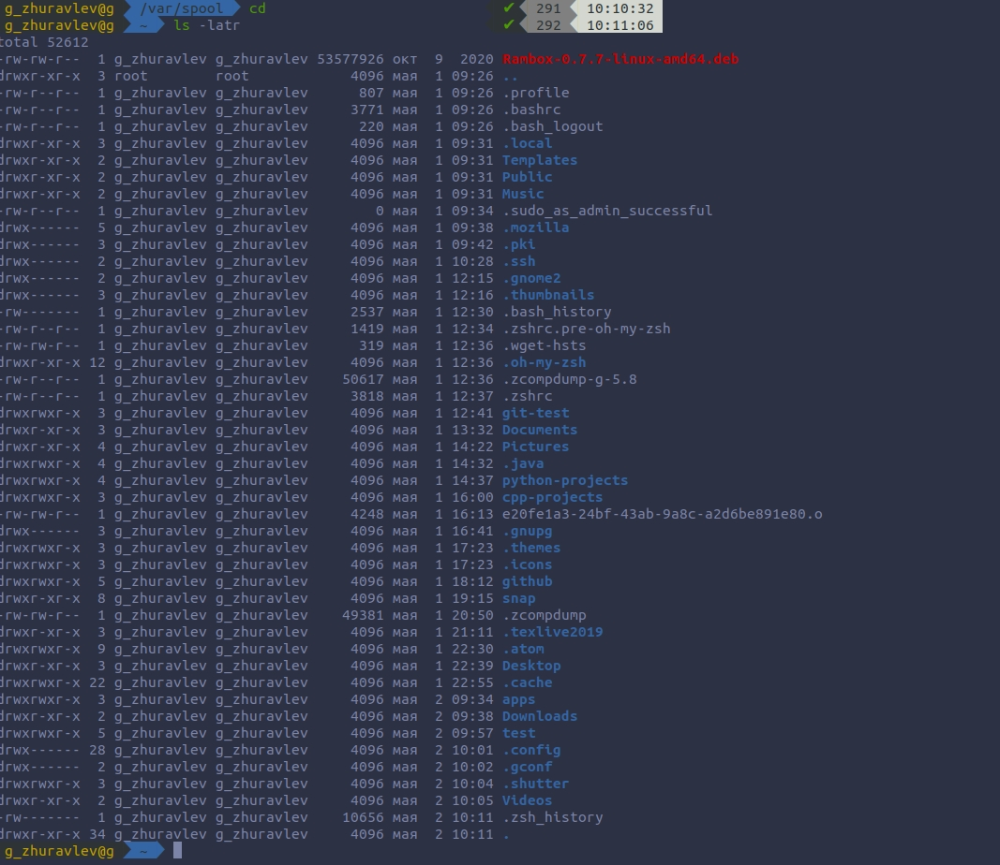
        Ответ на вопрос: Владельцем является g_zhuravlev, т.е. я.

### 3. Выполняем след. действия.

        3.1. Создаем каталог с именем newdir.
        3.2.  В каталоге ~/newdir создаем новый каталог с именем morefun.
        3.3.  В домашнем каталоге создаем одной командой три новых каталога с име-
        нами letters, memos, misk. Затем удаляем эти каталоги одной командой.
        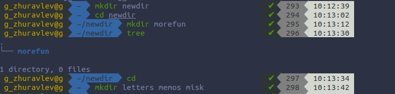
        
        Создание прошло успешно.
        
        Удаление прошло успешно.

        3.4.  Попробуем удалить ранее созданный каталог ~/newdir командой rm. Про-
        верим, был ли каталог удалён.
        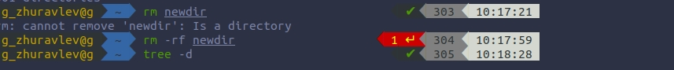
        Следствие: Каталог не был удален.

        3.5. Удаляем каталог ~/newdir/morefun из домашнего каталога. Проверяем,
        был ли каталог удалён.
        
        
        Следствие: Да, каталог был удалён.

### 4. С помощью команды man определяем, какую опцию команды ls нужно исполь-
###    зовать для просмотра содержимое не только указанного каталога, но  и подкаталогов, входящих в него.
        
        
        Следствие: Нужно использовать опцию "-R" -> "ls -R".

### 5.  С помощью команды man определяем набор опций команды ls, позволяющий от-
###     сортировать по времени последнего изменения выводимый список содержимого
###     каталога с развёрнутым описанием файлов.
        
        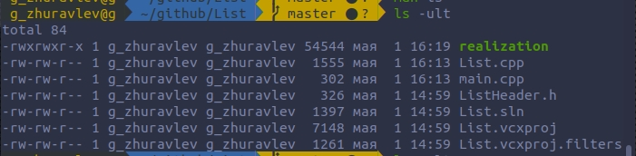
        Следствие: Набор опций -ult позволяет отсортировать по времени последнего изменения выводимый список содержимого каталога с развёрнутым описанием файлов.

### 6. Используем команду man для просмотра описания следующих команд: cd, pwd,
###    mkdir, rmdir, rm.
        6.1. cd
        Опции: no options.

        6.2. pwd
        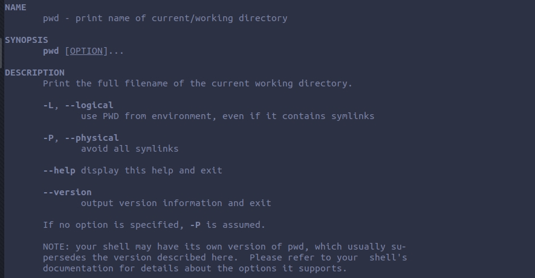
        Опции: --help -  выводит на экран опции команды;--version - версия.

        6.3. mkdir
        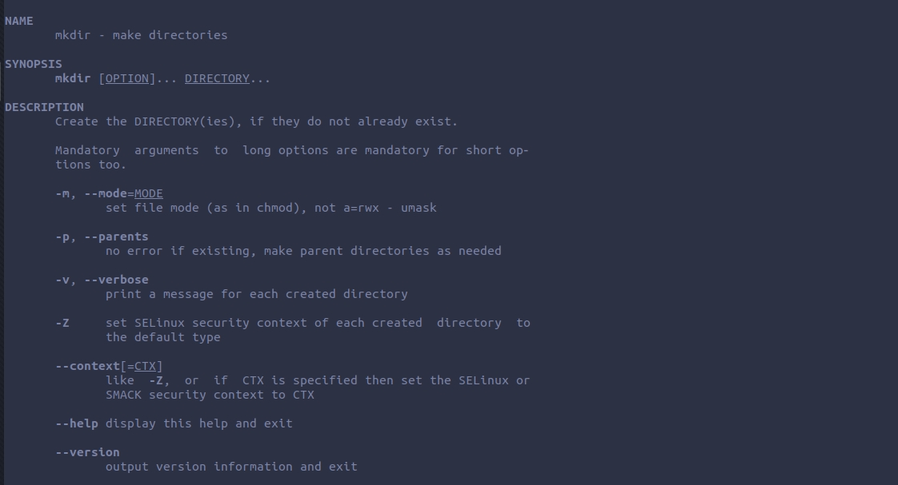
        Опции: -mode - изменяет права доступа.; -p - создаёт парентальную директорию; --help - выводит на экран опции команды.

        6.4. rmdir
        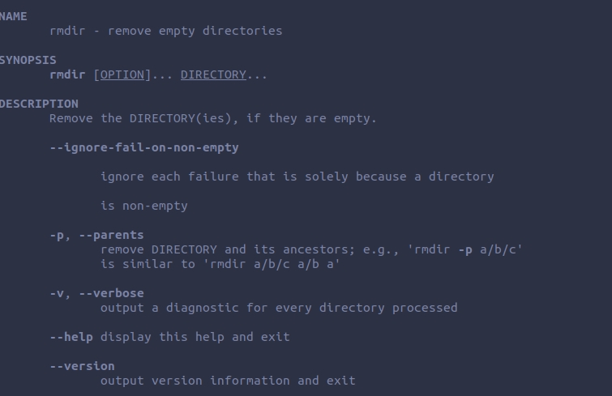
        Опции: -p - удаляет парентальную директорию; --help - выводит на экран опции команды.

        6.5. rm
        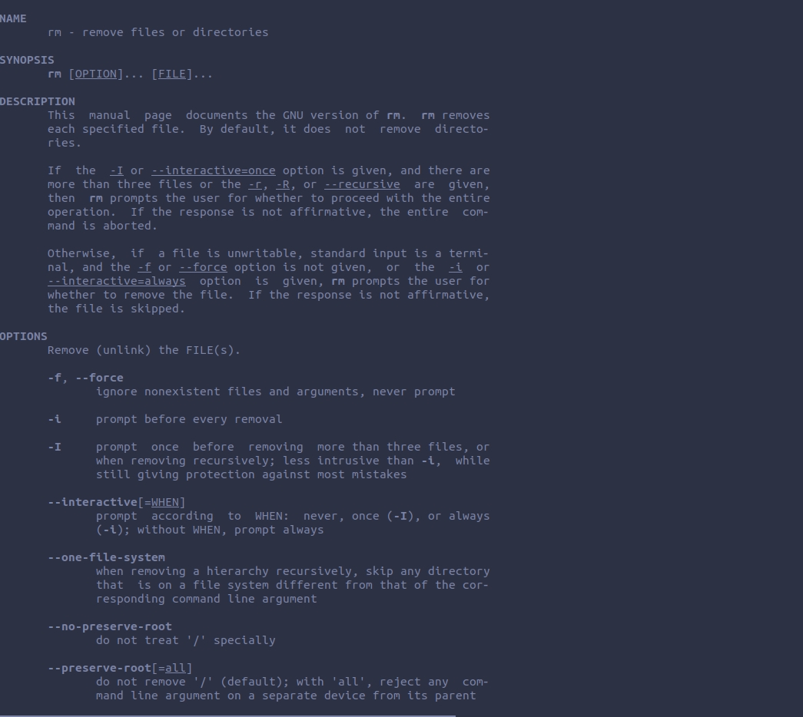
        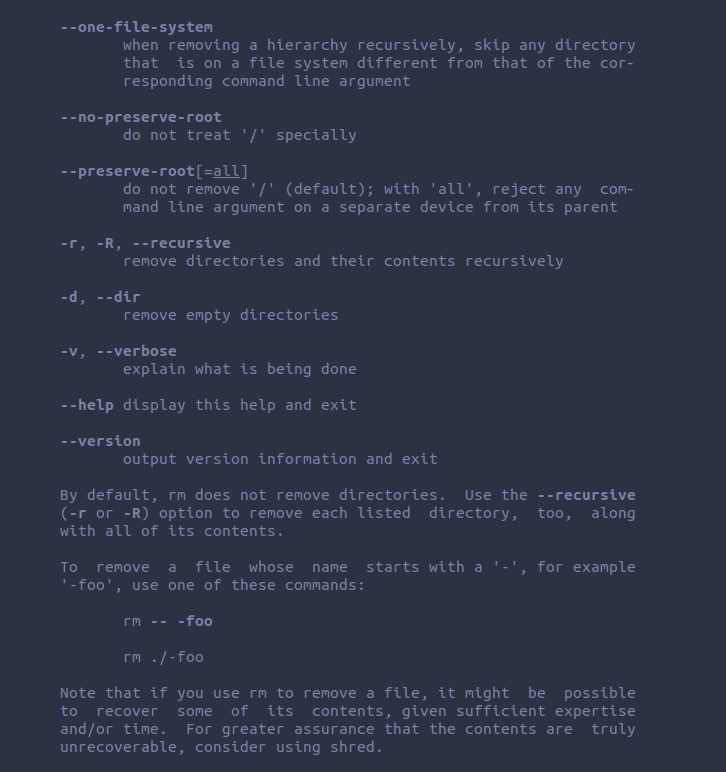
        Опции: -f - форсированное удаление ; -i - защищенное удаление ; -r - рекурсивное удаление;--help - выводит на экран опции команды.

### 7. Используя информацию, полученную при помощи команды history, выполните
### модификацию и исполнение нескольких команд из буфера команд.

        7.1. Выполним команду  history;  
        7.2. Исполним history !325 = cd List;
        7.3. Модифицируем и исполним команды
        ls -R -> ls -l ; man cd -> man pwd ;
        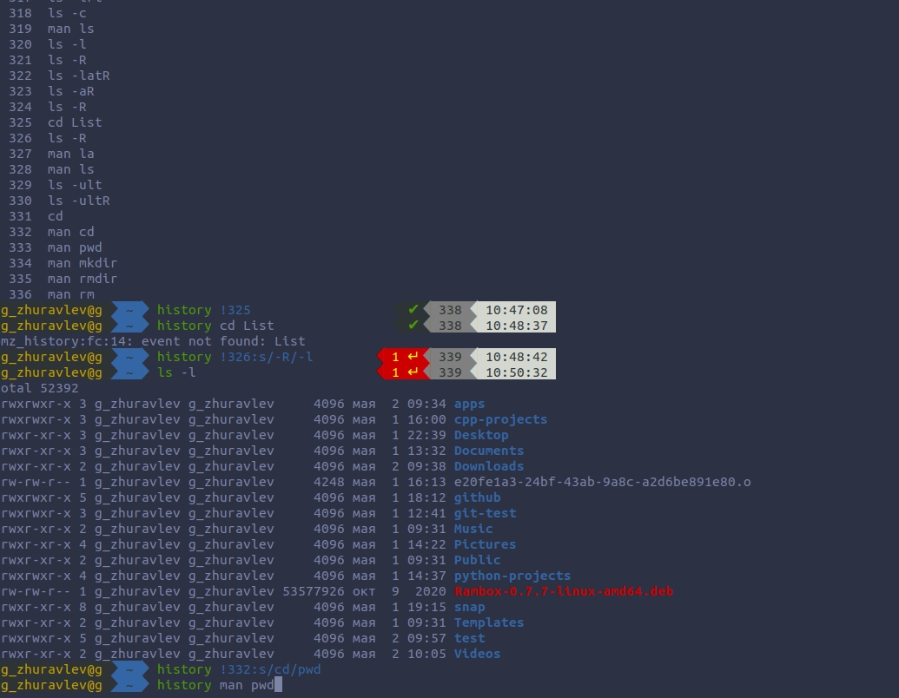
        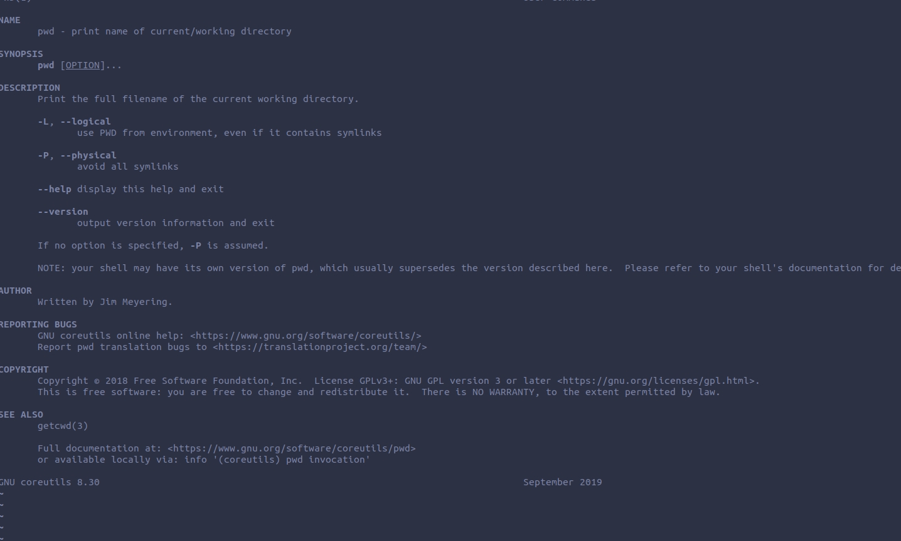

# Вывод
Благодаря этой лабораторной работе, я научился: пользоваться некоторыми командами,узнавать о них информацию(man); создавать каталоги и удалять их; выполнять поиск истории и модификацию вызова(history).
