# Цель работы
Приобретение практических навыков взаимодействия пользователя с системой посредством командной строки.

# Выполнение лабораторной работы

### 1. Определяем полное имя каталога
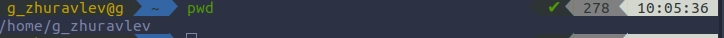

### 2. Переходим в каталог /tmp

        2.1. Выводим содержимое
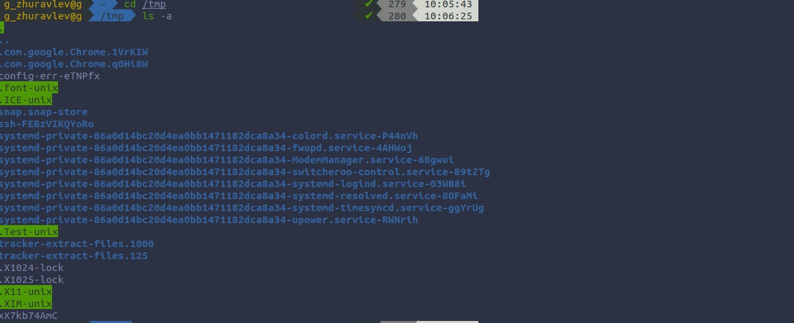
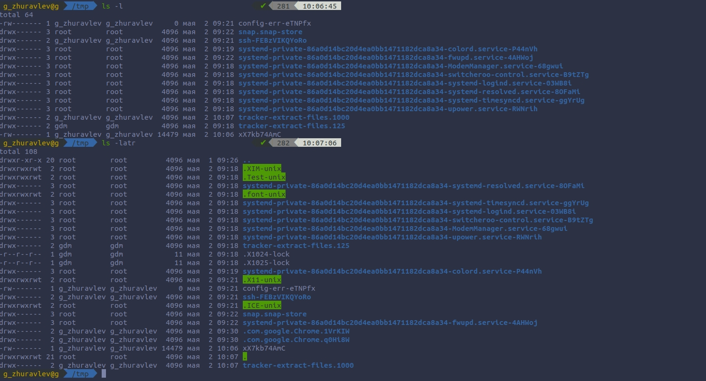

        2.2. Определяем есть ли в каталоге  /var/spool подкаталог с именем cron
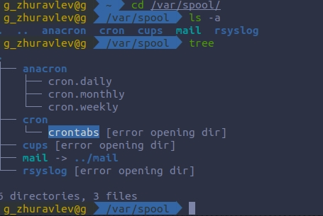
        Вывод: Да, есть.

        2.3. Переходим в домашний каталог  и выводим содержимое
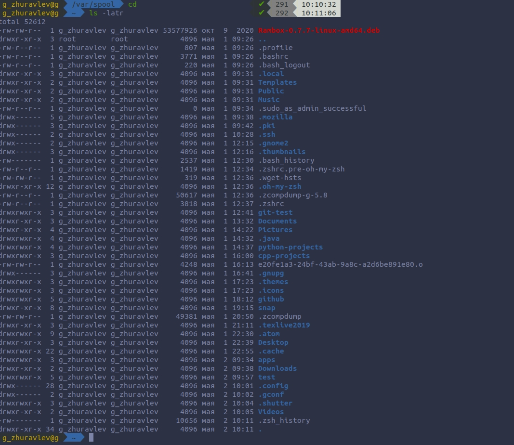
        Ответ на вопрос: Владельцем является g_zhuravlev, т.е. я.

### 3. Выполняем след. действия.

        3.1. Создаем каталог с именем newdir.
        3.2.  В каталоге ~/newdir создаем новый каталог с именем morefun.
        3.3.  В домашнем каталоге создаем одной командой три новых каталога с име-
        нами letters, memos, misk. Затем удаляем эти каталоги одной командой.
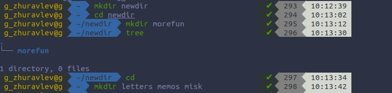

        Создание прошло успешно.

        Удаление прошло успешно.

        3.4.  Попробуем удалить ранее созданный каталог ~/newdir командой rm. Про-
        верим, был ли каталог удалён.
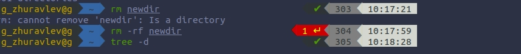
        Следствие: Каталог не был удален.

        3.5. Удаляем каталог ~/newdir/morefun из домашнего каталога. Проверяем,
        был ли каталог удалён.

        Следствие: Да, каталог был удалён.

### 4. С помощью команды man определяем, какую опцию команды ls нужно исполь-
###    зовать для просмотра содержимое не только указанного каталога, но  и подкаталогов, входящих в него.

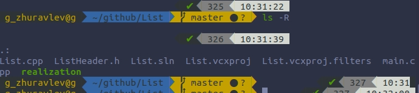
        Следствие: Нужно использовать опцию "-R" -> "ls -R".

### 5.  С помощью команды man определяем набор опций команды ls, позволяющий от-
###     сортировать по времени последнего изменения выводимый список содержимого
###     каталога с развёрнутым описанием файлов.

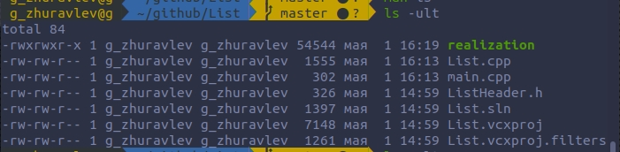
        Следствие: Набор опций -ult позволяет отсортировать по времени последнего изменения выводимый список содержимого каталога с развёрнутым описанием файлов.

### 6. Используем команду man для просмотра описания следующих команд: cd, pwd,
###    mkdir, rmdir, rm.
        6.1. cd
        Опции: no options.

        6.2. pwd
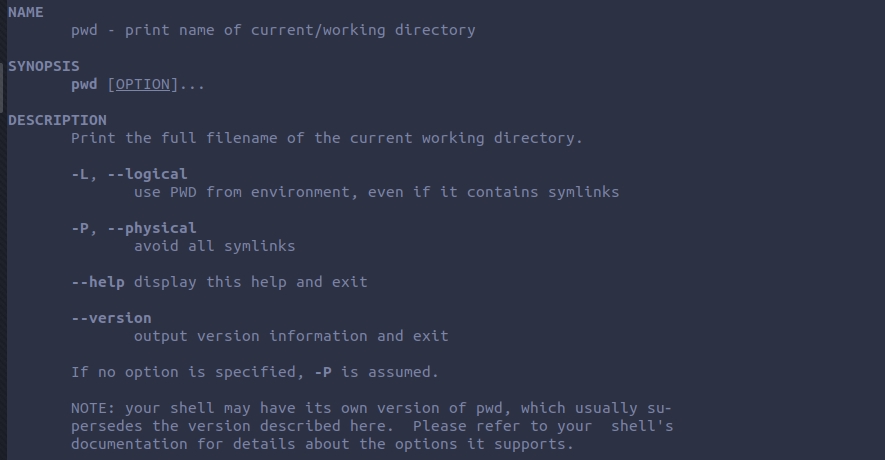
        Опции: --help -  выводит на экран опции команды;--version - версия.

        6.3. mkdir

        Опции: -mode - изменяет права доступа.; -p - создаёт парентальную директорию; --help - выводит на экран опции команды.

        6.4. rmdir
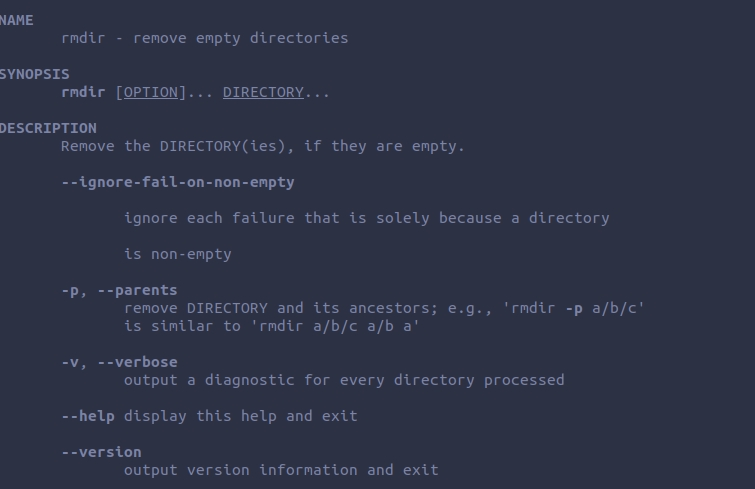
        Опции: -p - удаляет парентальную директорию; --help - выводит на экран опции команды.

        6.5. rm

        Опции: -f - форсированное удаление ; -i - защищенное удаление ; -r - рекурсивное удаление;--help - выводит на экран опции команды.

### 7. Используя информацию, полученную при помощи команды history, выполните
### модификацию и исполнение нескольких команд из буфера команд.

        7.1. Выполним команду  history;  
        7.2. Исполним history !325 = cd List;
        7.3. Модифицируем и исполним команды
        ls -R -> ls -l ; man cd -> man pwd ;

# Вывод
Благодаря этой лабораторной работе, я научился: пользоваться некоторыми командами,узнавать о них информацию(man); создавать каталоги и удалять их; выполнять поиск истории и модификацию вызова(history).

# Контрольные вопросы:

        1. Командная строка (или интерпретатор команд) — это программа, задача которой состоит в том, чтобы передавать ваши команды операционной системе и прикладным программам, а их ответы — вам.

        2. Для определения абсолютного пути к текущему каталогу используется команда pwd (print working directory).
        Пример (абсолютное имя текущего каталога пользователя g_zhuravlev):
        pwd -> результат:/home/g_zhuravlev

        3. При помощи команды ls [-option]/ tree[-option]
        Пример: ls -R                        
        .:
        presentation.md

        4. Скрытые файлы — файлы которые скрыты от пользователя. Чтобы скрыть файл нужно перед названием поставить точку. Чтобы отобразить имена имена скрытых ->  ls –a

        5.Команда для удаления файла — rm ; для удаления папки— rmdir или rm –d Пример:
        mkdir newdir
        rm newdir
        rm: newdir is a directory
        rmdir newdir

        6. Используя команду history.

        7. С помощью команды history узнать номер команды, потом написать ошибку и ее замену.

        8. Если нужно выполнить  несколько команд, записанный в одной строке, то  используется символ ";"
        Пример:
        mkdir newdir ; touch newdir/newfile.txt

        9. Символ экранирования- «\» используется, если в названии файла есть знаки «.», «*», «/» и т.п., ставится перед этими знаками, чтоб команда не приняла эти символы как за команду

        10. ls -l — показывает доп. информацию о файле:дата изменения, права, владельцев и т.д.( лонг листинг)

        11. Относительный путь — путь к файлу к которому не нужно задавать полное местонахождение, а можно обойтись быстым вводом. Примеры относительных путей:
        file.сpp (файл лежит в той же папке)

        ./file.cpp (файл лежит в той же папке. такая запись иногда требуется в некоторых UNIX системах)

        images/picture.jpg (файл лежит в капке images, которая находится в текущей)

        ../file.cpp (файл лежит в папке, которая расположена на один уровень выше от текущей)

        ../../file.cpp (файл лежит в папке, которая расположена на два уровня выше от текущей

        примеры абсолютных путей: /images/picture.gif

        12. Можно использовать man; --help;[command] --info

        13. Введя первые буквы и нажав клавишу Tab.
