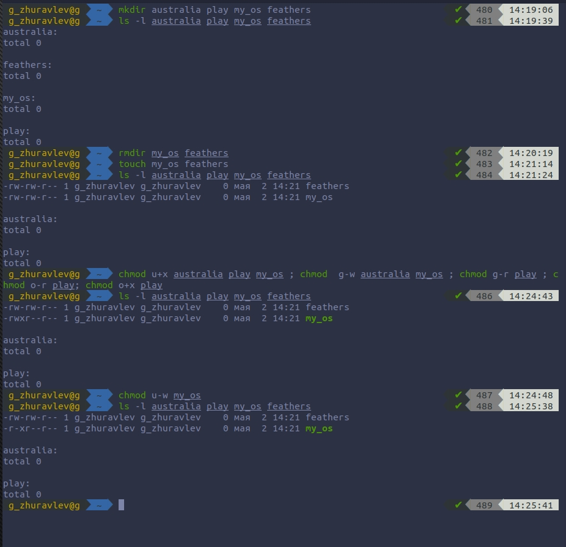

# Цель работы
Ознакомление с файловой системой Linux, её структурой, именами и содержа-
нием каталогов. Приобретение практических навыков по применению команд для
работы с файлами и каталогами, по управлению процессами (и работами), по про-
верке использования диска и обслуживанию файловой системы.

# Выполнение лабораторной работы

### 1. Выполняем все примеры, приведённые в первой части описания лабораторной работы.
        1.1.  Копирование файла в текущем каталоге. Скопировать файл ~/abc1 в файл april и в файл may

        1.2.  Копирование нескольких файлов в каталог. Скопировать файлы april и may в каталог monthly
        1.3.   Копирование файлов в произвольном каталоге. Скопировать файл monthly/may в файл с именем june

        1.4.  Копирование каталогов в текущем каталоге. Скопировать каталог monthly в каталог monthly.00
        1.5.  Копирование каталогов в произвольном каталоге. Скопировать каталог

        1.6.   Переименование файлов в текущем каталоге. Изменить название файла april на july в домашнем каталоге
        1.7.   Перемещение файлов в другой каталог. Переместить файл july в каталог monthly.00  

        1.8.   Переименование каталогов в текущем каталоге. Переименовать каталог monthly.00 в monthly.01
        1.9.   Перемещение каталога в другой каталог. Переместить каталог monthly.01 в каталог reports
        1.10.  Переименование каталога, не являющегося текущим. Переименовать каталог reports/monthly.01 в reports/monthly

        1.11.  Требуется создать файл ~/may с правом выполнения для владельца
        1.12.  Требуется лишить владельца файла ~/may права на выполнение

        1.13.  Требуется создать каталог monthly с запретом на чтение для членов группы и всех остальных пользователей.

        1.14.  Требуется создать файл ~/abc1 с правом записи для членов группы.

### 2. Выполним следующие действия.

        2.1.  Скопируем файл /usr/include/search.h в домашний каталог и назовём
        его equipment.

        2.2. В домашнем каталоге создадим директорию ~/ski.plases.
        2.3. Переместим файл equipment в каталог ~/ski.plases.
        2.4. Переименуем файл ~/ski.plases/equipment в ~/ski.plases/equiplist.
        2.5. Создадим в домашнем каталоге файл abc1 и скопируем его в каталог ~/ski.plases, назовём его equiplist2.
        2.6. Создадим каталог с именем equipment в каталоге ~/ski.plases.
        2.7. Переместим файлы ~/ski.plases/equiplist и equiplist2 в каталог
        ~/ski.plases/equipment.

        2.8. Создадим и переместим каталог ~/newdir в каталог ~/ski.plases и назовём его plans.

### 3. Определим опции команды chmod, необходимые для того, чтобы присвоить пе-
###    ечисленным ниже файлам выделенные права доступа, считая, что в начале та-
###    ких прав нет.
         начальные значения: ---------
        3.1. Создаем каталоги и файлы.
        3.2. изменяем права командой chmod.

        1. for australia: mkdir australia(d) -> chmod u+r, u+w, u+x, g+r, o+r australia
        2. for play: mkdir play(d)-> chmod u+r, u+w, u+x, g+x, o+x play
        3. for my_os: touch my_os(-) -> chmod u+r, u+x, g+r, o+r my_os
        4. for feathers: touch feathers -> chmod u+r, u+w, g+r, g+w, o+r feathers

### 4. Проделем приведённые упражнения.
        4.1. Просмотрим содержимое файла /etc/password.( команда  sudo cat)

        4.2. Скопируем файл ~/feathers в файл ~/file.old.
        4.3. Переместим файл ~/file.old в каталог ~/play.
        4.4. Скопируем каталог ~/play в каталог ~/fun.
        4.5. Переместим каталог ~/fun в каталог ~/play и назовём его games.

        4.6. Лишим владельца файла ~/feathers права на чтение.

        4.7. Просмотрим этот файл с помощью  cat и 4.8. Попробуем скопировать

        Ответ: нехватка прав.

        4.9.  Дадим владельцу файла ~/feathers право на чтение.
        4.10. Лишим владельца каталога ~/play права на выполнение.
        4.11. Перейдём в каталог ~/play -> нехватка прав.
        4.12. Дадим владельцу каталога ~/play право на выполнение.

### 5. Прочитаем man по командам mount, fsck, mkfs, kill и кратко их охарактери-
###    зуем, приведя примеры.

        1. mount

        Описание: Команда mount монтирует устройство и позволяет присоединить хранящиеся на нем файлы к общему дереву каталогов.
        Структура: mount [device_name] [mount_point]

        2. fsck

        Описание:Fsck команда взаимодействует с соответствующей файловой системой конкретных FSCK команд, созданной авторами файловой системы. Независимо от типа вашей файловой системы, Fsck как правило, имеет три режима работы:

        1. Проверка на наличие ошибок и подсказывает пользователю интерактивное решение, как решить индивидуальные проблемы;
        2. Проверка на наличие ошибок и постарается автоматически исправить все ошибки;
        3. Проверка на наличие ошибок без возможности восстановить их, но тогда выдаст ошибки на стандартный вывод.
        Структура: fsck

        3. mkfs

        Описание: “make file system” (создать файловую систему). Команда обычно используется для управления устройствами хранения в Linux. Вы можете рассматривать mkfs как инструмент командной строки для форматирования диска в определенной файловой системе.
        Структура: mkfs -t [fs type] [target device]

        4. kill

        Описание: Когда вы выполняете команду "kill", то фактически вы посылаете системе сигнал, чтобы заставить ее завершить некорректно ведущее себя приложение. Доступно до 60 сигналов.
        Вы можете просмотреть все сигналы с помощью команды: $ kill -l
        Структура: kill [SIGKILL] PID

# Вывод
Благодаря этой лабораторной работе, я научился: пользоваться некоторыми командами; копировать каталоги и удалять их; перемещать файлы и каталоги; копировать файлы и каталоги;  изменять права доступа к файлам и каталогам.

# Контрольные вопросы:
    1 и 2. Файловая система в дисплейном классе содержит следующие каталоги первого уровня:
    /bin - Основные программы, необходимые для работы в системе: командные оболочки shell, основные утилиты.
     /boot - Каталог, который содержит ядро системы— главную программу, загружающую и исполняющую все остальные.

    /dev - Каталог, в котором содержатся псевдофайлы устройств. С точки зрения Linux все физические устройства, как главные, так и периферийные, представляют собой файлы особого типа, в которые система может записывать данные и из которых она может их считывать. Пользователь не должен работать с этими файлами, поскольку запись неправильных данных в файл устройства может повредить устройство или хранящиеся на нём данные.

    /etc - В этом каталоге содержатся системные конфигурационные файлы — текстовые файлы, которые считываются при загрузке системы и запуске программ и определяют их поведение. Настройка и администрирование Linux в конечном итоге сводится к редактированию этих файлов, даже если оно выполняется при помощи графических средств конфигурирования системы.

    /home - В структуре файловой системы Linux каждый пользователь имеет отдельный личный каталог для своих данных (т.н. домашний каталог), и все пользовательские каталоги выделены в отдельный общий каталог /home.

    /mnt - Каталоги для монтирования файловых систем сменных устройств и внешних файловых систем.

    /proc - Файловая система на виртуальном устройстве, её файлы содержат информацию о текущем состоянии системы.

    /root - Каталог администратора системы.

    /sbin - Системные утилиты.

    /usr - Программы и библиотеки, доступные пользователю.

    /var - Рабочие файлы программ, различные временные данные: очереди (письма на отправку, файлы на печать и др.), системные журналы (файлы, в которые записывается информация о происходящих в системе событиях).

    /tmp - Временные файлы.

    3. Чтобы содержимое некоторой файловой системы было доступно операционной системе должно быть выполнено монтирование тома.(mount)

    4. Основные причины нарушения целостности файловой системы:

    -   Один блок адресуется несколькими mode (принадлежит нескольким файлам).

    - Блок помечен как свободный, но в то же время занят (на него ссылается onode).

    - Блок помечен как занятый, но в то же время свободен (ни один inode на него не ссылается).

    - Неправильное число ссылок в inode (недостаток или избыток ссылающихся записей в каталогах).

    -   Несовпадение между размером файла и суммарным размером адресуемых inode блоков.

    -   Недопустимые адресуемые блоки (например, расположенные за пределами файловой системы).

    - "Потерянные" файлы (правильные inode, на которые не ссылаются записи каталогов).

    - Недопустимые или неразмещенные номера inode в записях каталогов.

    Чтобы устранить повреждения файловой системы используется команда fsck.

    5. mkfs создаёт новую файловую систему.

    6. Характеристика команд, которые позволяют просмотреть текстовые файлы:

    - для просмотра небольших файлов - cat.

    - для просмотра больших файлов - less — она позволяет осуществлять постраничный просмотр файлов.

    - для просмотра начала файла - head[-n], по умолчанию она выводит первые 10 строк файла.

    - команда tail[-n] выводит несколько (по умолчанию 10) последних строк файла.

    7. Основные возможности команды cp:

    - копирование файла в текущем каталоге.

    - копирование нескольких файлов в каталог.

    - копирование файлов в произвольном каталоге.

     -i в команде cp выведет на экран запрос подтверждения о перезаписи файла, если на место целевого файла вы поставите имя уже существующего файла.

    Команда cp с опцией r (recursive) позволяет рекурсивно копировать каталоги вместе с входящими в них файлами и каталогами.

    8. Команды mv и mvdir предназначены для перемещения и переименования файлов и каталогов.
    Формат команды: mv [-option] старый_файл новый_файл.
    Для получения предупреждения перед переписыванием файла стоит использовать опцию i.

    9. Права доступа определяют, кто и что может делать с содержимым файла. Существуют три группы прав доступа: для владельца файла, для членов группы, для всех остальных Для изменения прав доступа к файлу или каталогу используется команда chmod. Права доступа к файлу может поменять только владелец или суперпользователь (администратор). Формат команды: chmod режим имя_файла. Режим (в формате команды) имеет следующую структуру и способ записи:
    = установить право;

    - лишить права;

    + дать право;

    r чтение;

    w запись;

    x выполнение;

     u (user) владелец файла;

    g (group) группа, к которой принадлежит владелец файла;

    o (others) все остальные.
