# Цель работы
Ознакомление с инструментами поиска файлов и фильтрации текстовых дан-
ных. Приобретение практических навыков: по управлению процессами (и задания-
ми), по проверке использования диска и обслуживанию файловых систем.

# Выполнение лабораторной работы

### 1. Запишем в файл file.txt названия файлов, содержащихся в каталоге /etc и домашнем каталоге
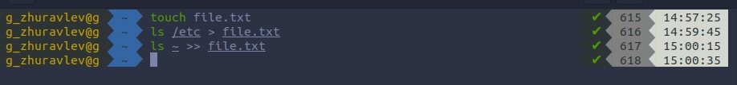

### 2. Выводим имена всех файлов из file.txt, имеющих расширение .conf, далее запишем их в новый текстовой файл conf.txt.
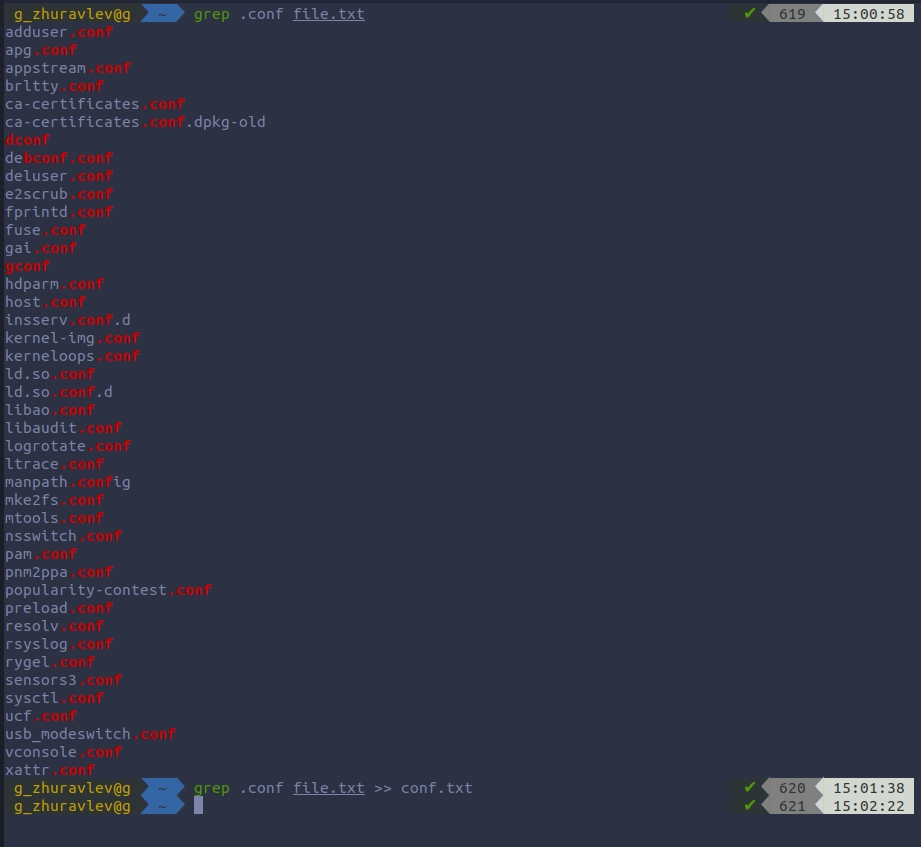

### 3. Определим, какие файлы в нашем домашнем каталоге имеют имена, начинающиеся с символа "с". 2 типа.
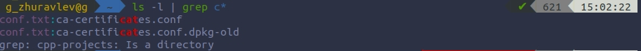
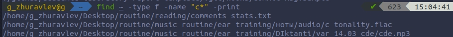

### 4. Выведем на экран (по-странично) имена файлов из каталога /etc, начинающиеся с символа h.
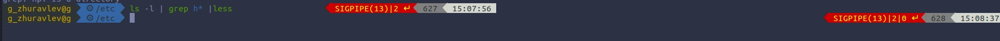

### 5. Запустим в фоновом режиме процесс, который будет записывать в файл ~/logfile файлы, имена которых начинаются с log и удалим файл ~/logfile.
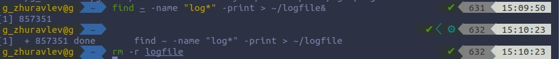

### 6. Запустим из консоли в фоновом режиме редактор gedit.
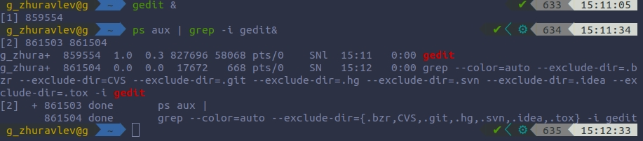

### 7. Определим идентификатор процесса gedit, используя команду ps, конвейер и фильтр grep. ( PID = 859554)

### 8. Прочтём справку (man) команды kill, после чего воспользуемся ею для завершения процесса gedit.
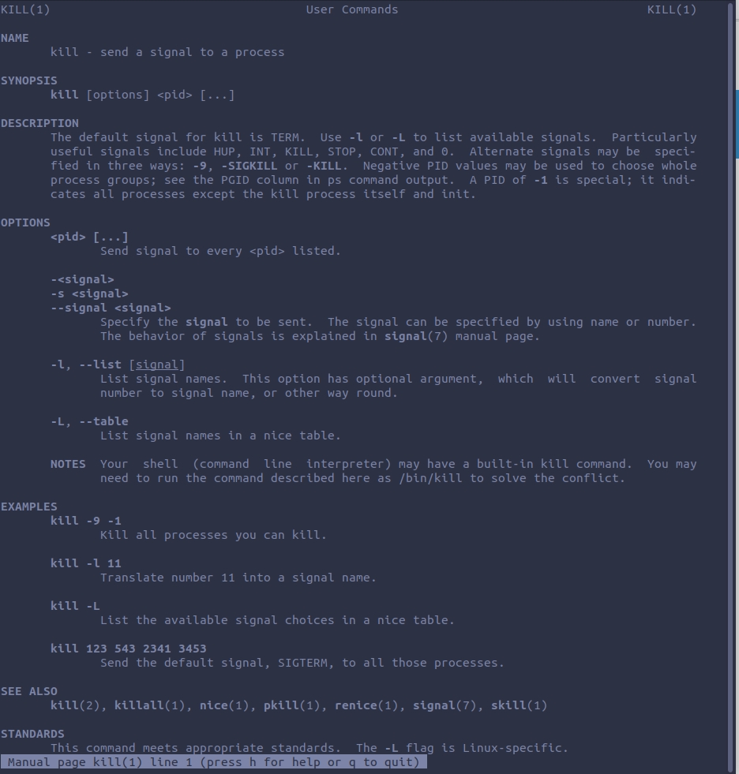
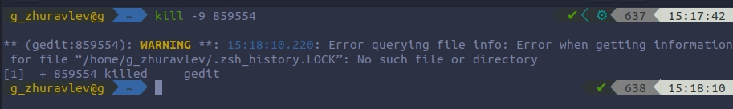

### 9. Выполним команды df и du, предварительно получив более подробную информацию об этих командах, с помощью команды man.
        9.1. df
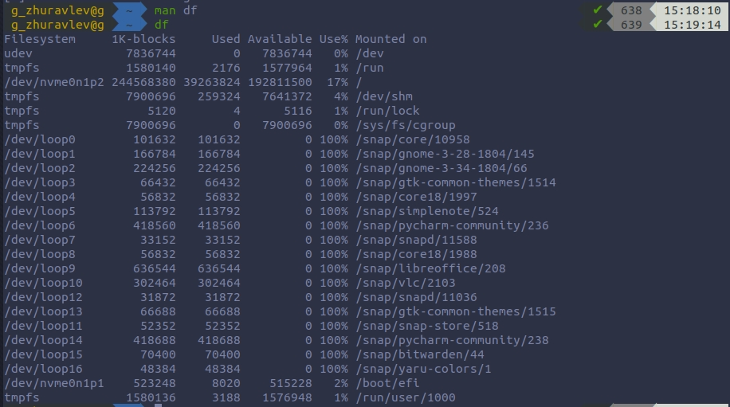
        9.2. du
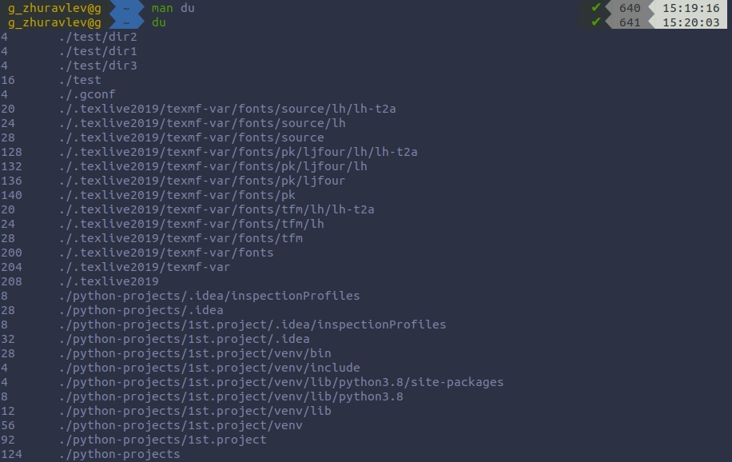

### 10. Воспользовавшись справкой команды find, выведем имена всех директорий, имеющихся в нашем домашнем каталоге.
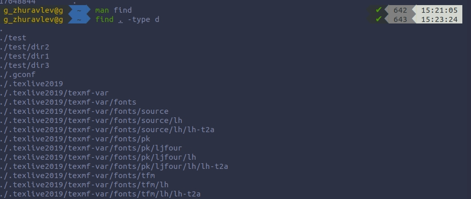

# Вывод
Благодаря этой лабораторной работе, я научился: пользоваться инструментами поиска файлов и фильтрацией текстовых данных. Также я приобрел навыки: проверки диска; обслуживания файловых систем; управления процессами.
