# Цель работы
Ознакомление с инструментами поиска файлов и фильтрации текстовых дан-
ных. Приобретение практических навыков: по управлению процессами (и задания-
ми), по проверке использования диска и обслуживанию файловых систем.

# Выполнение лабораторной работы

### 1. Запишем в файл file.txt названия файлов, содержащихся в каталоге /etc и домашнем каталоге
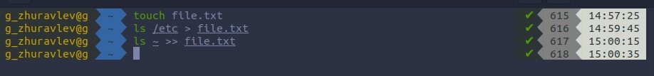

### 2. Выводим имена всех файлов из file.txt, имеющих расширение .conf, далее запишем их в новый текстовой файл conf.txt.
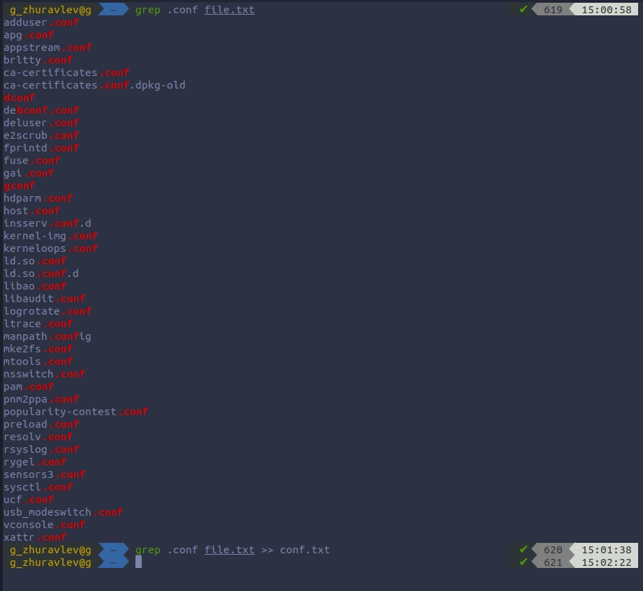

### 3. Определим, какие файлы в нашем домашнем каталоге имеют имена, начинающиеся с символа "с". 2 типа.
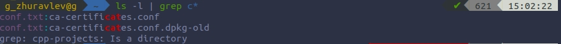
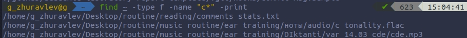

### 4. Выведем на экран (по-странично) имена файлов из каталога /etc, начинающиеся с символа h.
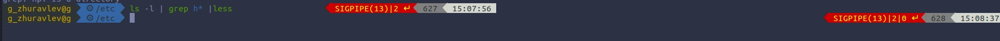
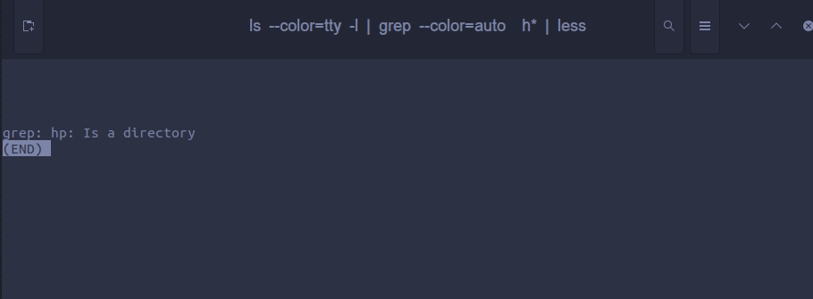

### 5. Запустим в фоновом режиме процесс, который будет записывать в файл ~/logfile файлы, имена которых начинаются с log и удалим файл ~/logfile.
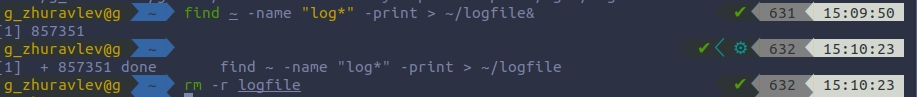

### 6. Запустим из консоли в фоновом режиме редактор gedit.
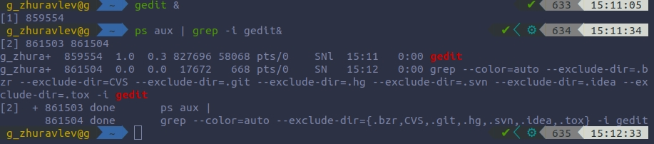

### 7. Определим идентификатор процесса gedit, используя команду ps, конвейер и фильтр grep. ( PID = 859554)

### 8. Прочтём справку (man) команды kill, после чего воспользуемся ею для завершения процесса gedit.
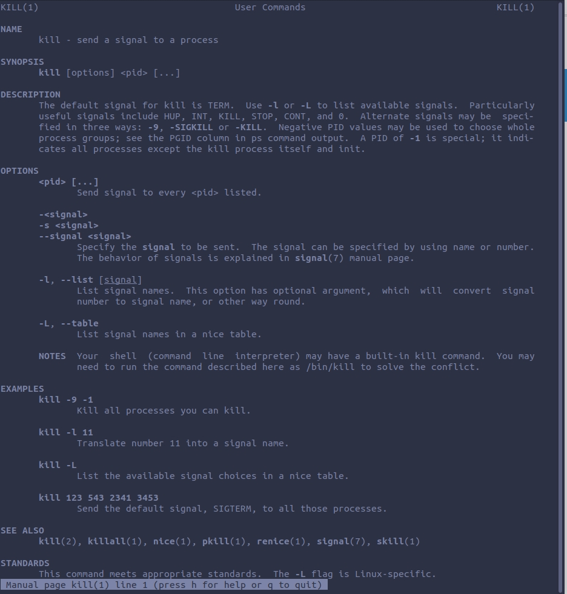
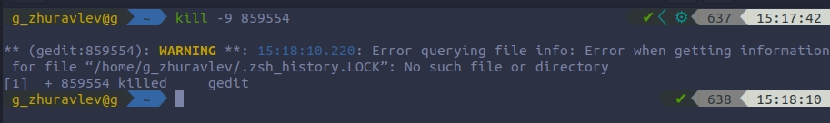

### 9. Выполним команды df и du, предварительно получив более подробную информацию об этих командах, с помощью команды man.
        9.1. df
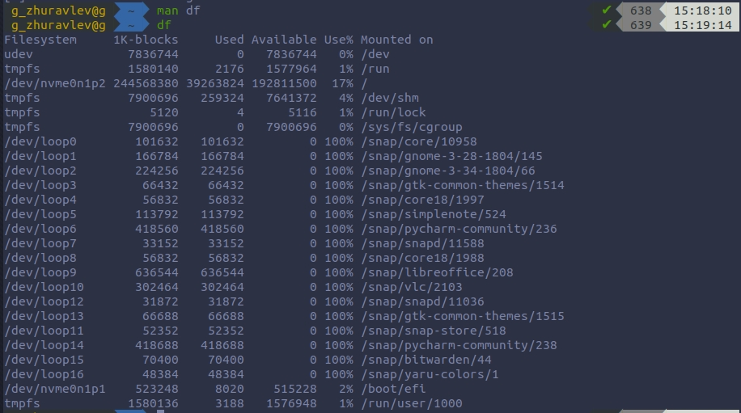
        9.2. du
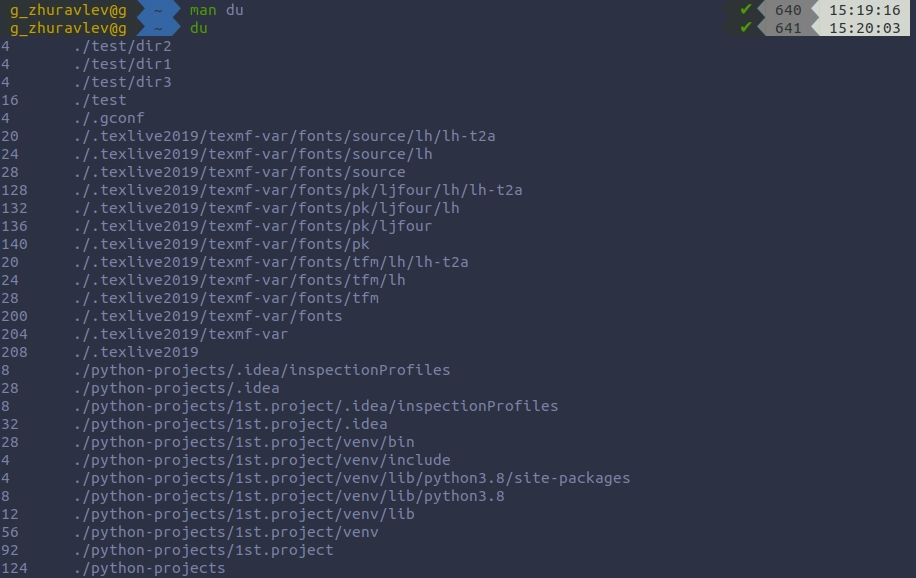

### 10. Воспользовавшись справкой команды find, выведем имена всех директорий, имеющихся в нашем домашнем каталоге.
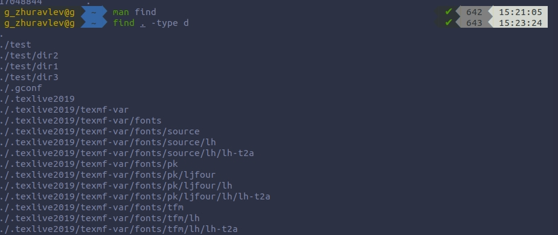

# Вывод
Благодаря этой лабораторной работе, я научился: пользоваться инструментами поиска файлов и фильтрацией текстовых данных. Также я приобрел навыки: проверки диска; обслуживания файловых систем; управления процессами.

# Контрольные вопросы
        1. В системе по умолчанию открыто три специальных потока:
        – stdin — стандартный поток ввода (по умолчанию: клавиатура), файловый дескриптор 0;
        – stdout — стандартный поток вывода (по умолчанию: консоль), файловый дескриптор 1;
        – stderr — стандартный поток вывод сообщений об ошибках (по умолчанию: консоль), файловый дескриптор 2.

        2. > - перенаправление stdout в файл. Если файл отсутствовал, то он создаётся, иначе - перезаписывается. >> - перенаправление stdout в файл. Если файл отсутствовал, то он создаётся, иначе - добавляется.

        3. Конвейер (pipe)- инструумент для объединения простых команд или утилит в цепочки.

        4. Процесс это - совокупность программного кода и данных, загруженных в память ЭВМ. Любой команде, выполняемой в системе.  Процессом называют выполняющуюся программу и все её элементы: адресное пространство, глобальные переменные, регистры, стек, открытые файлы и т.д..
        Программа - единица выполняемого процесса.

        5. PID — personal identificator (идентификатор) процесса в многозадачной ОС. GID – group identificator -идентификатор группы.

        6. Запущенные фоном программы называются задачами (jobs). Ими можно управлять с помощью команды jobs, которая выводит список запущенных в данный момент задач. Для завершения задачи необходимо выполнить команду kill %номер задачи.

        7. Команда htop — продвинутый монитор процессов, показывает динамический список системных процессов, список обычно выравнивается по использованию ЦПУ. В отличие от top, htop показывает все процессы в системе.

        Команда top в Linux системах позволяет вывести в виде таблицы перечень
        запущенных процессов и оценить, какой объем ресурсов они потребляют.

        8. Команда find используется для поиска и отображения имён файлов. Формат команды: find путь [-опции]

        Примеры:

        - вывести на экран имена файлов из вашего домашнего каталога и его подкаталогов, начинающихся на f: find ~ -name "f*" -print

        - вывести на экран имена файлов в каталоге /etc, начинающихся с символа p:
        find /etc -name "p*" -print

        9. Найти файл по контексту позволяет команда grep.
        Формат команды: grep строка имя_файла

        Примеры:
        - показать строки во всех файлах в вашем домашнем каталоге с именами, начинающимися на f, в которых есть слово begin: grep begin f*

        - найти в текущем каталоге все файлы, в имени которых есть буквосочетание «car»: ls -l | grep car

        10. Df - позволяет определить объем свободной памяти на жёстком диске позволяет.

        11. df /home/<user_name> - позволяет определить объем домашнего каталога позволяет команда df /home/<user_name>

        12. Удалить зависший процесс можно командой kill %номер задачи.
