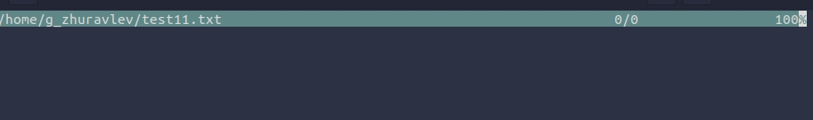

# Цель работы
Освоение основных возможностей командной оболочки Midnight Commander.
Приобретение навыков практической работы по просмотру каталогов и файлов; ма-
нипуляций с ними.

## 1. Задание по mc

### 1. Изучил информацию о mc, вызвав в командной строке man mc.

### 2. Запустил из командной строки mc, изучил его структуру и меню.

### 3. Выполнил несколько операций в mc, используя управляющие клавиши.

Копирование.

Просмотр/изменение прав.

Сортинг файлов.

### 4. Выполнил основные команды меню левой (правой) панели. Вывод информации о файлах изменяется в зависимости от выбора режима просмотра.

Сортинг файлов.

Листинг файлов.

### 5. Используя возможности подменю Файл, выполнил:

        1. Просмотр содержимого текстового файла;

        2. Редактирование содержимого текстового файла (без сохранения результатов);

        3. Создание каталога;

        4. Копирование файлов в созданный каталог;

### 6. С помощью соответствующих средств подменю "command" осуществил:

        1. Поиск в файловой системе файла с заданными условиями;

        2. Выбор и повторение одной из предыдущих команд;

        3. Анализ файла меню и файла расширений;

### 7. Вызвал подменю Настройки. Освоил операции, определяющие структуру экрана mc.

## 2. Задание по втроенному редактору.

### 1. Создал текстовый файл test11.txt

### 2. Открыл этот файл с помощью встроенного в mc редактора.

### 3. Вставил текст.

### 4. Проделал с текстом следующие манипуляции, используя горячие клавиши:

        4.1. Удалил строку текста.(ctrl+y)(4.1.)

        4.2. Выделил фрагмент текста(fn+f3) и скопировал его на новую строку.(fn+f5)

        4.3. Выделил фрагмент текста(fn+f3) и перенес его на новую строку.(fn+f6)

        4.4. Сохранил файл.

        4.5. Отменил последнее действие.

    4.6. Перешел в конец файла и написал текст.

        4.7. Перешел в начало файла и написал некоторый текст.

        4.8. Сохранил и закрыл файл.

### 5. Открыл файл с исходным текстом.(c++)

### 6. Используя меню редактора, включил подсветку синтаксиса.

# Вывод:
Благодаря этой лабораторной работе, я научился: пользоваться некоторыми опциями оболочки MC; приобрел навыки практической работы по просмотру каталогов и файлов.
