# Цель работы
познакомиться с операционной системой Linux, получить практические навыки работы с редактором vi, установленным по умолчанию практически во всех дистрибутивах.

### 1. Создание нового файла с использованием vi.

        1.1. Создал каталог с именем ~/work/os/lab06.
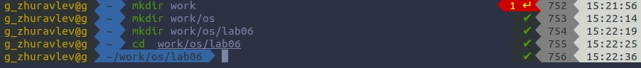

        1.2. Першел во вновь созданный каталог.

        1.3. Вызвал vi и создал файл hello.sh
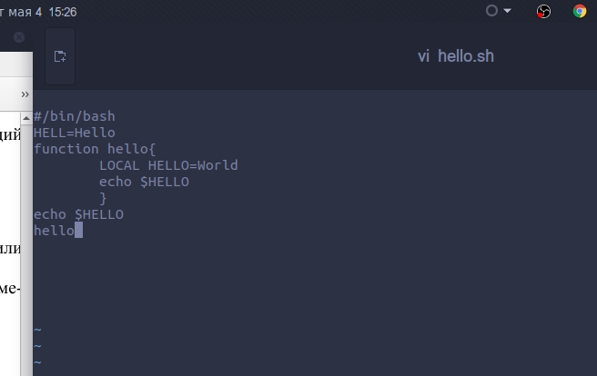

        1.4. Нажал клавишу i и ввел следующий текст:

        1.5. Нажал клавишу Esc для перехода в командный режим после завершения ввода текста.
        1.6. Нажал «:» для перехода в режим последней строки.
        1.7. Нажал w и q , а затем нажал клавишу Enter для сохранения текста и выхода.
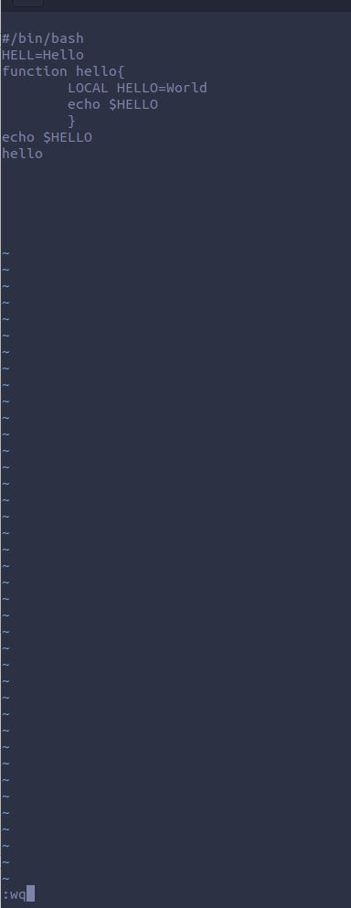

        1.8. Изменил право доступа на исполнение.
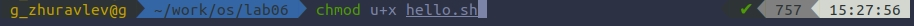

### 2. Редактирование существующего файла.

        2.1. Вызвал vi на редактирование файла.
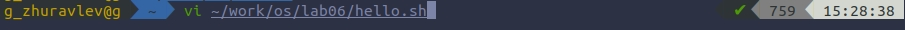

        2.2. Установил курсор в конец слова HELL второй строки.( esc + w)
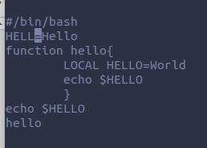

        2.3. Перешел в режим вставки(i) и заменил на HELLO. Нажал Esc для возврата в командный режим.
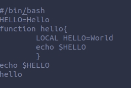

        2.4. Установил курсор на четвертую строку(w) и стёр слово LOCAL(dw).

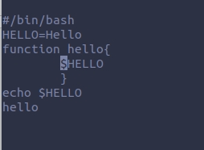

        2.5. Перешел в режим вставки(i) и набрал : local, нажал Esc для возврата в командный режим.
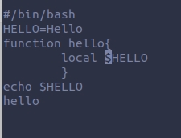

        2.6. Установил курсор на последней строке файла(shift+g). Вставил после неё строку: echo $HELLO.(ctrl+y->ctrl+p)
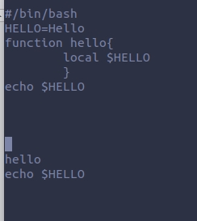

        2.7. Нажал Esc для перехода в командный режим.
        2.8. Удалил последнюю строку.(shift+d)

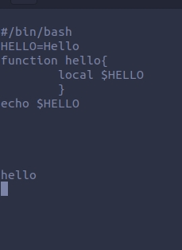

        2.9. Ввел команду отмены изменений (u) для отмены последней команды.
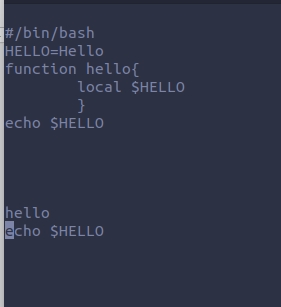

        2.10. Ввел символ «:» для перехода в режим последней строки. Записал произведённые изменения и вышел из vi.(wq)

# Вывод:
Благодаря этой лабораторной работе, я научился: исполнять некоторые команды в редакторе vi; редактировать файлы в этом редакторе; пользоваться горячими клавишами редактора.
