# Цель работы
познакомиться с операционной системой Linux, получить практические навыки работы с редактором vi, установленным по умолчанию практически во всех дистрибутивах.

### 1. Создание нового файла с использованием vi.

        1.1. Создал каталог с именем ~/work/os/lab06.
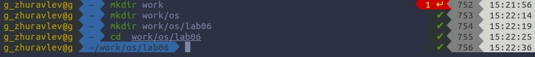

        1.2. Першел во вновь созданный каталог.

        1.3. Вызвал vi и создал файл hello.sh
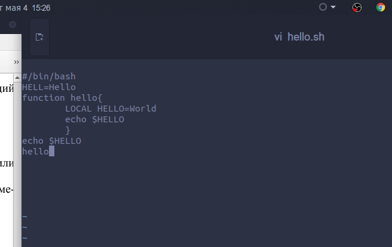

        1.4. Нажал клавишу i и ввел следующий текст:

        1.5. Нажал клавишу Esc для перехода в командный режим после завершения ввода текста.
        1.6. Нажал «:» для перехода в режим последней строки.
        1.7. Нажал w и q , а затем нажал клавишу Enter для сохранения текста и выхода.
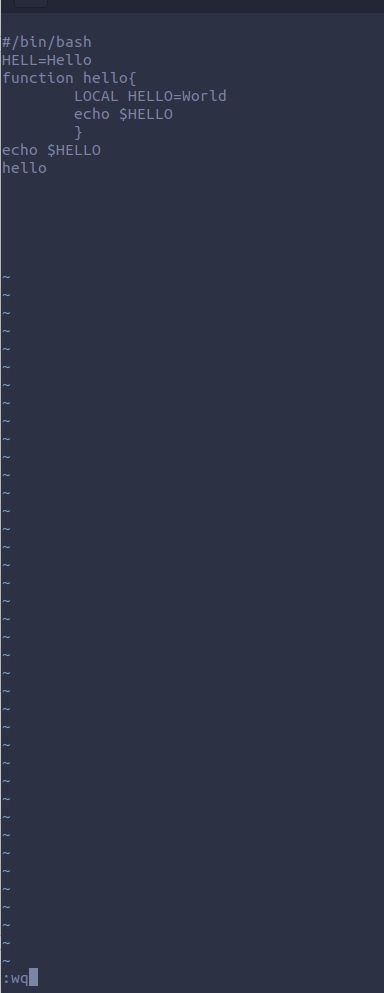

        1.8. Изменил право доступа на исполнение.

### 2. Редактирование существующего файла.

        2.1. Вызвал vi на редактирование файла.
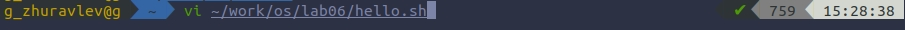

        2.2. Установил курсор в конец слова HELL второй строки.( esc + w)
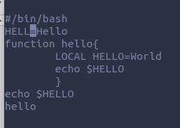

        2.3. Перешел в режим вставки(i) и заменил на HELLO. Нажал Esc для возврата в командный режим.
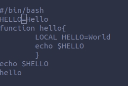

        2.4. Установил курсор на четвертую строку(w) и стёр слово LOCAL(dw).

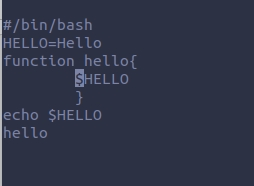

        2.5. Перешел в режим вставки(i) и набрал : local, нажал Esc для возврата в командный режим.
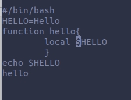

        2.6. Установил курсор на последней строке файла(shift+g). Вставил после неё строку: echo $HELLO.(ctrl+y->ctrl+p)
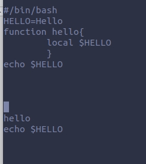

        2.7. Нажал Esc для перехода в командный режим.
        2.8. Удалил последнюю строку.(shift+d)

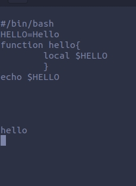

        2.9. Ввел команду отмены изменений (u) для отмены последней команды.
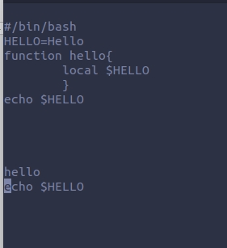

        2.10. Ввел символ «:» для перехода в режим последней строки. Записал произведённые изменения и вышел из vi.(wq)
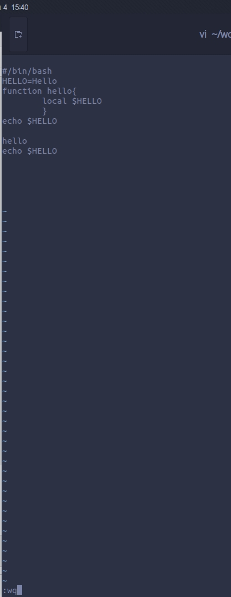

# Вывод:
Благодаря этой лабораторной работе, я научился: исполнять некоторые команды в редакторе vi; редактировать файлы в этом редакторе; пользоваться горячими клавишами редактора.

# Контрольные вопросы

    1.Краткая характеристика режимов работы редактора vi:

    – командный режим — предназначен для ввода команд редактирования и навигации по редактируемому файлу;

    – режим вставки — предназначен для ввода содержания редактируемого файла;

    – режим последней (или командной) строки — используется для записи изменений
    в файл и выхода из редактора.

    2. Выйти из редактора, без сохранения изменений, можно используя клавиши «:q!».

    3. Краткая характеристика команд позиционирования:

    – 0 (ноль) — переход в начало строки;

    – $ — переход в конец строки;

    – G — переход в конец файла;

    – n G — переход на строку с номером n.

    4. Для редактора vi словом является: буквы, находящиеся между двумя пробелами;
    пробел;

    5. В конец файла можно перейти с помощью клавиш (shift+g) и курсора вниз, а в начало – курсор вверх.

    6. Краткая характеристика основных групп команд редактирования:

    6.1. Вставка текста:

    – а — вставить текст после курсора;

    – А — вставить текст в конец строки;

    – i — вставить текст перед курсором;

    – ni — вставить текст n раз;

    – I — вставить текст в начало строки.

    6.2. Вставка строки:

    – о — вставить строку под курсором;

    – О — вставить строку над курсором.

    6.3. Удаление текста:

    – x — удалить один символ в буфер;

    – dw — удалить одно слово в буфер;

    – d$ — удалить в буфер текст от курсора до конца строки;

    – d0 — удалить в буфер текст от начала строки до позиции курсора;

    – dd — удалить в буфер одну строку;

    – ndd — удалить в буфер n строк. Отмена и повтор произведённых изменений

    – u — отменить последнее изменение;

    – . — повторить последнее изменение.

    6.4. Копирование текста в буфер

    – Y — скопировать строку в буфер;

    – nY — скопировать n строк в буфер;

    – yw — скопировать слово в буфер.

    6.5. Вставка текста из буфера

    – p — вставить текст из буфера после курсора;

    – P — вставить текст из буфера перед курсором. Замена текста

    – cw — заменить слово;

    – ncw — заменить n слов;

    – c$ — заменить текст от курсора до конца строки;

    – r — заменить слово;

    – R — заменить текст.

    6.6. Поиск текста

    – / text — произвести поиск вперёд по тексту указанной строки;

    – ? text — произвести поиск назад по тексту указанной строки символов текст.

    7. Можно использовать клавиши ni, чтобы заполнить строку символами $.

    8. Отменить некорректное действие, связанное с процессом редактирования, можно с помощью клавиши "u".

    9. Характеристика основных групп команд режима последней строки:
    9.1. Копирование и перемещение текста:

    – : n,m d — удалить строки с n по m;

    – : i,j m k — переместить строки с i по j, начиная со строки k;

    – : i,j t k — копировать строки с i по j в строку k;

    – : i,j w name — записать строки с i по j в файл с именем name.

    9.2. Запись в файл и выход из редактора:

    – : w — записать изменённый текст в файл, не выходя из vi;

    – : w name — записать изменённый текст в новый файл с именем name;

    – : w! name — записать изменённый текст в файл с именем name;

    – : wq — записать изменения в файл и выйти из vi;

    – : q — выйти из редактора vi;

    – : q! — выйти из редактора без записи;

    – : e! — вернуться в командный режим, отменив все изменения, произведённые со времени последней записи.

    10. Используя клавишу $ (переход в конец строки) можно определить, не перемещая курсора, позицию, в которой заканчивается строка.

    11. Опции редактора vi позволяют настроить рабочую среду.

    Для задания опций используется команда set (в режиме последней строки):

    – : set all — вывести полный список опций;

    – : set nu — вывести номера строк;

    – : set list — вывести невидимые символы;

    – : set ic — не учитывать при поиске, является ли символ прописным или
    строчным.

    Если вы хотите отказаться от использования опции, то в команде set перед именем опции нужно написать no.

    12. Определить режим работы редактора vi можно по последней командной строке.

    13. Взаимосвязь режимов работы редактора vi:
     Командный режим  –> режим вставки –> последняя строка (командная строка).
