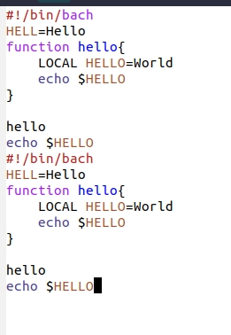

# Цель работы
Познакомиться с операционной системой Linux, получить практические навыки работы с редактором Emacs.

### 1. Открыл emacs.

### 2. Создал файл lab07.sh с помощью комбинации (C-x C-f).

### 3. Набрал текст:

### 4. Сохранил файл с помощью комбинации (C-x C-s).(wrote /home/g_zhuravlev/lab07.sh)

### 5. Проделал с текстом стандартные процедуры редактирования, каждое действие осуществлялось комбинацией клавиш:

        5.1. Вырезал одной командой целую строку (С-k).

        5.2. Вставил эту строку в конец файла (C-y).

        5.3. Выделил область текста (C-space).
        5.4. Скопировал область в буфер обмена (M-w).

        5.5. Вставил область в конец файла.

        5.6. Ещё раз выделил эту область и на этот раз удалил её в буфер обмена(C-w).

        5.7. Отменил последнее действие (C-/).

### 6. Использовал некоторые команды по перемещению курсора:

        6.1. Переместил курсор в начало строки (C-a).

        6.2. Переместил курсор в конец строки (C-e).

        6.3. Переместил курсор в начало буфера (M-<).

        6.4. Переместил курсор в конец буфера (M->).

### 7. Управление буферами.

        7.1. Вывел список активных буферов на экран (C-x C-b).

        7.2. Переместился во вновь открытое окно (C-x) o со списком открытых буферов и переключился на другой буфер.

        7.3. Закрыл это окно (C-x 0).

        7.4. Вновь переключился между буферами, но без вывода их списка на экран (C-x b).

### 8. Управление окнами.

        8.1. Поделил фрейм на 4 части: разделил фрейм на два окна по вертикали
        (C-x 3), а затем каждое из этих окон на две части по горизонтали (C-x 2).

        8.2. В каждом из четырёх созданных окон открыл новый буфер (файл) и ввёл несколько строк текста.

### 9. Режим поиска.

        9.1. Переключился в режим поиска (C-s) и нашёл несколько слов, присутствующих в тексте.

        9.2. Переключился между результатами поиска, нажимая C-s.

        9.3. Вышел из режима поиска, нажав C-g.

        9.4. Перешел в режим поиска и замены (M-%), ввел текст, который следует найти и заменить, нажал Enter , затем ввел текст для замены. После того как были подсвечены результаты поиска, нажал ! для подтверждения замены.

        9.5. Испробовал другой режим поиска, нажав M-s o. Он отличается от обычного режима тем, что при поиске указывает номера строк в которых найдено введённое слово и выделяет их цветом. В обычном режиме выделение цветом появляется, только когда нужно подтвердить замену.

# Вывод.
Благодаря этой лабораторной работе, я научился: исполнять некоторые команды в редакторе emacs; редактировать файлы в этом редакторе; пользоваться горячими клавишами редактора.

# Контрольные вопросы:

        1. Emacs - мощный экранный редактор текста, написанный на
        языке Elisp.

        2. Программа - чрезвычайно сложна для освоения из-за своей многогранности.

        3. Буфер – объект, состоящий из текста.
        Окно – прямоугольная область с одним из буферов.

        4. Да, в одном окне можно открыть больше 10 буферов.

        5. После запуска emacs без каких-либо параметров в основном окне отображается буфер *scratch*, который используется для оценки выражений Emacs Lisp, а также для заметок, которые вы не хотите сохранять. Этот буфер не сохраняется автоматически.

        6. Чтобы ввести  C-c | я использую Ctrl+c и Shift+\ ;  для C-c C-|: Ctrl+c и Ctrl+Shift+\.

        7. Поделить окно на две части можно двумя комбинациями клавиш:
        C-x 3(вертикально) или C-x 2(горизонтально).

        8. Настройки emacs хранятся в файле .emacs, который хранится в домашней дирректории пользователя.

        9. Клавиша "enter" выполняет функцию перемещения курсора в открытом окне, и, её можно переназначить.

        10. Редактор emacs более понятен для меня. Интерфейс и горячие клавиши, деление окна и т.п. Работать мне было приятнее именно на данном редакторе.
