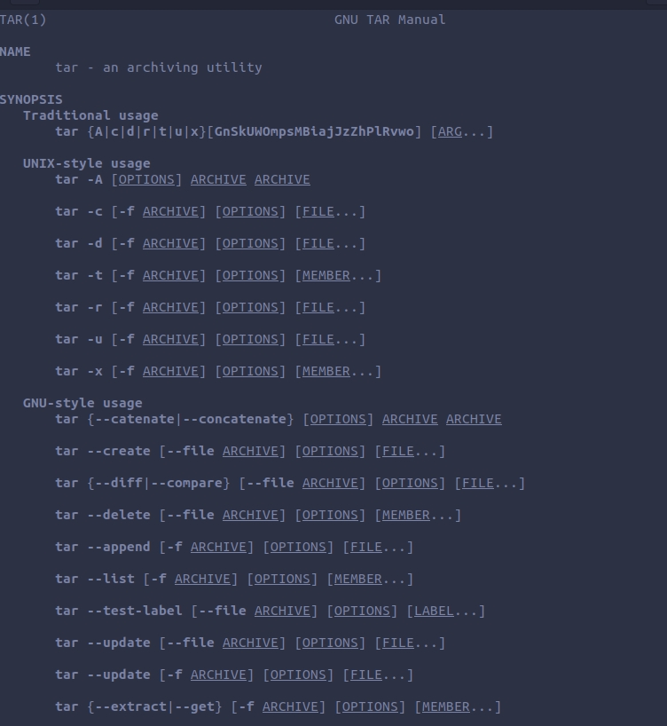
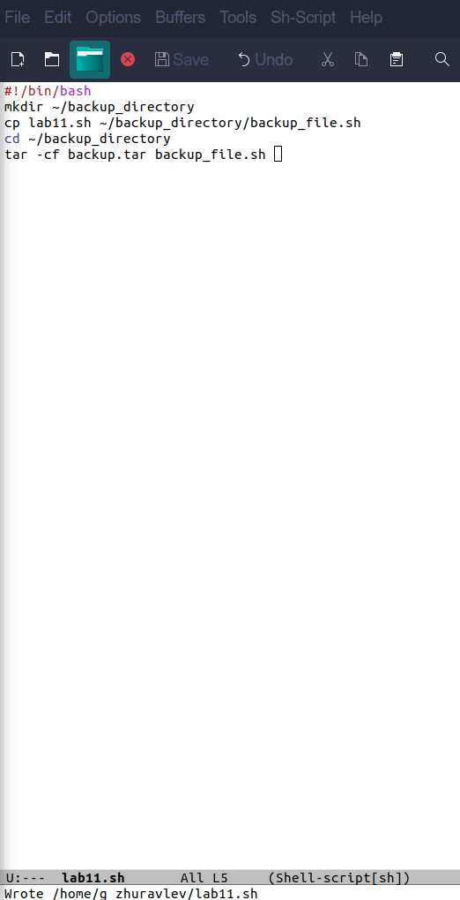
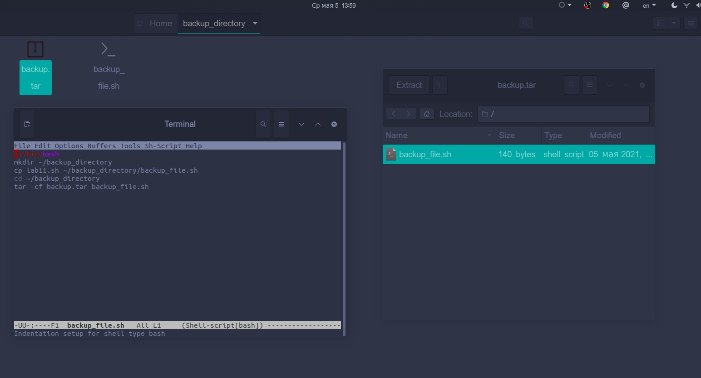
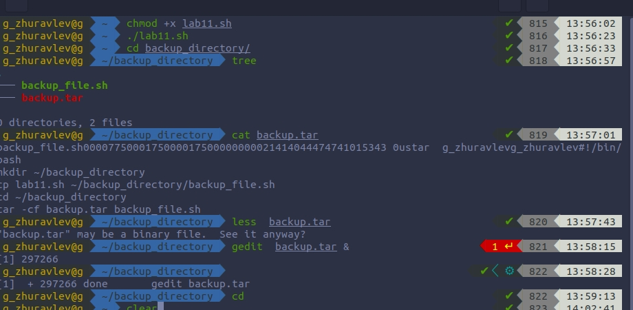
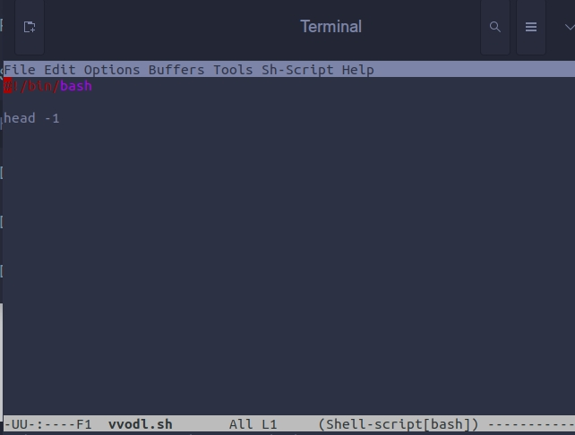
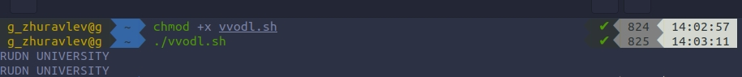
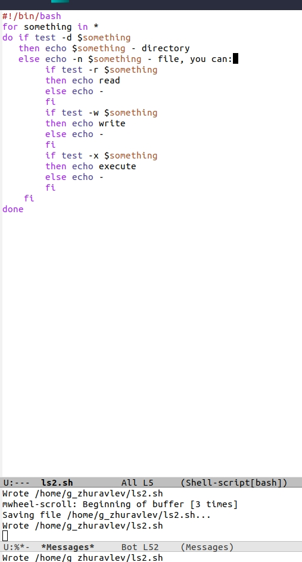
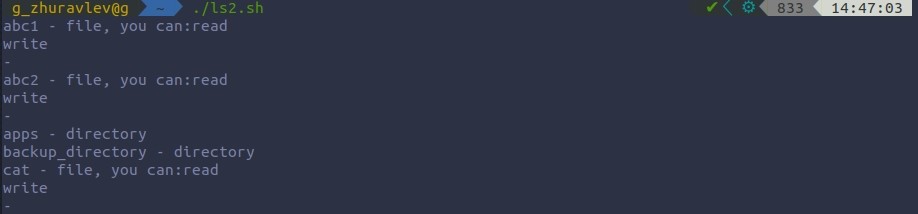
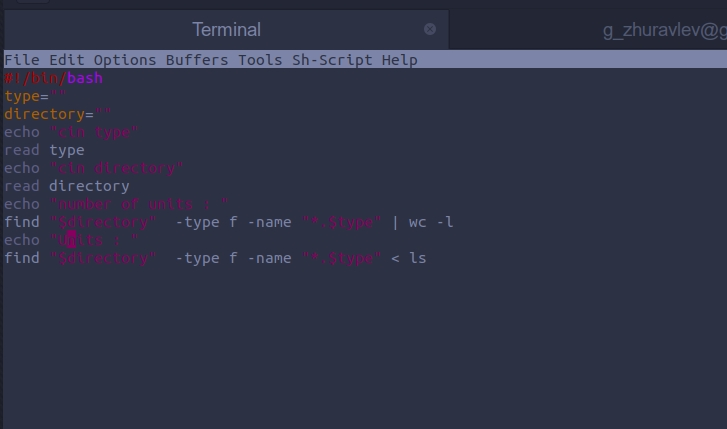
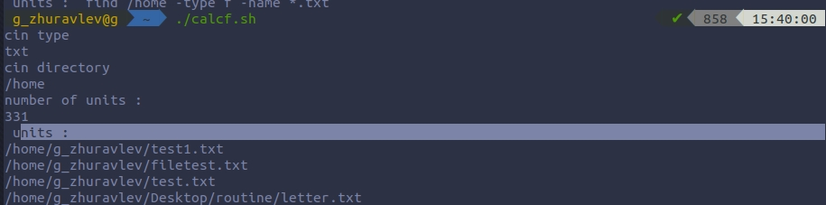

# Цель работы
 Изучить основы программирования в оболочке ОС UNIX/Linux, научиться писать небольшие командные файлы.

# Ход работы

### 1. Написал скрипт, который при запуске будет делать резервную копию самого себя в другую директорию backup в домашнем каталоге. При этом файл архивируется с помощью tar.

        1.1. Прочитал мануал.

        1.2. Написал скрипт и проверил его работу.

   

### 2. Написал пример командного файла, обрабатывающего любое произвольное число аргументов командной строки, в том числе превышающее десять. В качестве примера сделал вывод строки.   

### 3. Написал командный файл — аналог команды ls (без использования самой этой команды и команды dir).

### 4. Написал командный файл, который получает в качестве аргумента командной строки формат файла (.txt, .doc, .jpg, .pdf и т.д.), вычисляет количество таких файлов в указанной директории и выводит их на экран.

# Вывод.
Благодаря этой лабораторной работе я изучил некоторые команды языка bash; научился писать небольшие командные файлы.
