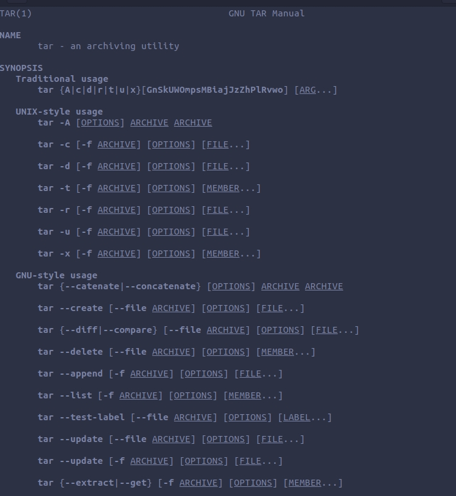
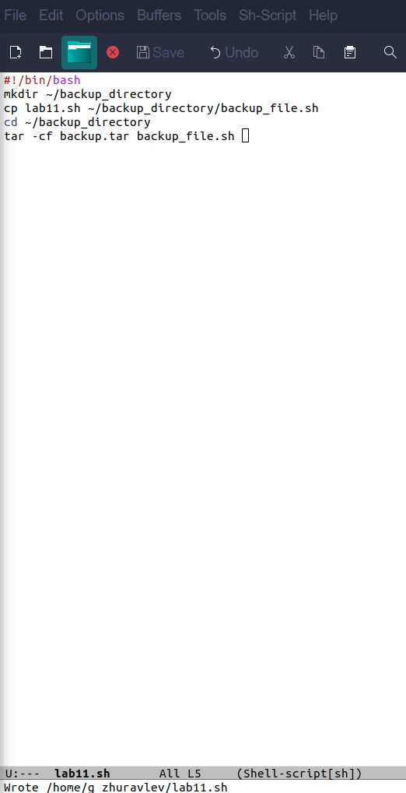
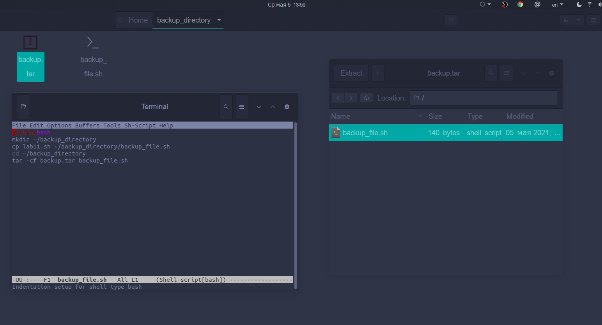
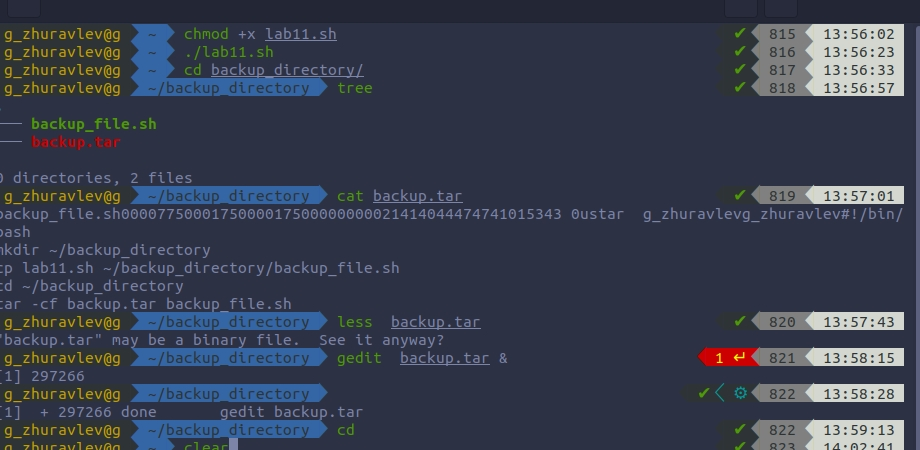
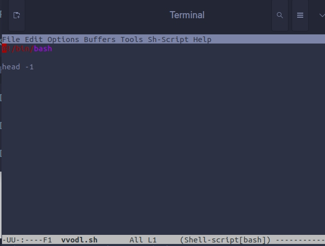
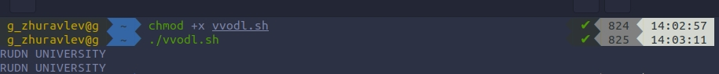
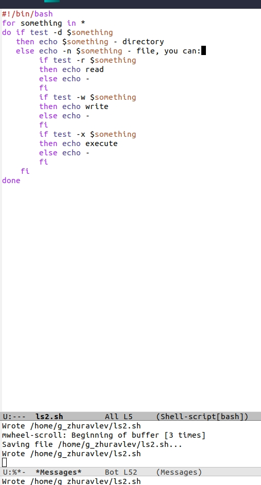
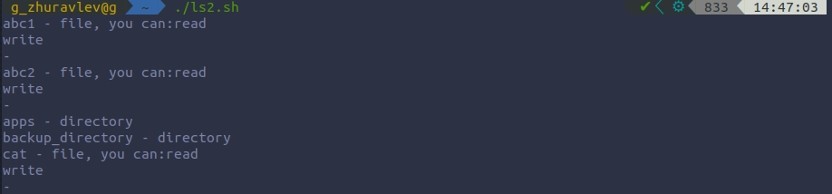
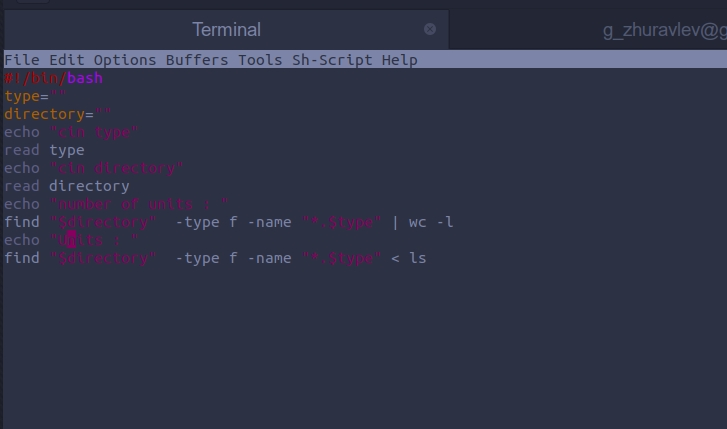
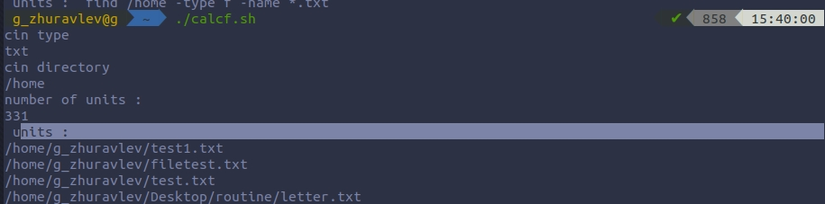

# Цель работы
 Изучить основы программирования в оболочке ОС UNIX/Linux, научиться писать небольшие командные файлы.

# Ход работы

### 1. Написал скрипт, который при запуске будет делать резервную копию самого себя в другую директорию backup в домашнем каталоге. При этом файл архивируется с помощью tar.

        1.1. Прочитал мануал.

        1.2. Написал скрипт и проверил его работу.

   

### 2. Написал пример командного файла, обрабатывающего любое произвольное число аргументов командной строки, в том числе превышающее десять. В качестве примера сделал вывод строки.   

### 3. Написал командный файл — аналог команды ls (без использования самой этой команды и команды dir).

### 4. Написал командный файл, который получает в качестве аргумента командной строки формат файла (.txt, .doc, .jpg, .pdf и т.д.), вычисляет количество таких файлов в указанной директории и выводит их на экран.

# Вывод.
Благодаря этой лабораторной работе, я изучил некоторые команды языка bash; научился писать небольшие командные файлы.

# Контрольные вопросы.

        1. Командная оболочка— это программа, позволяющая взаимодействовать с операционной системой .В UNIX подобных наиболее часто
        используются следующие реализации командных оболочек:

        – оболочка Борна (Bourne shell или sh) — стандартная командная оболочка
        UNIX/Linux, содержащая базовый, но при этом полный набор функций;

        – оболочка Корна (или ksh) — напоминает оболочку С, но операторы управления
        программой совместимы с операторами оболочки Борна;

        2. POSIX — набор стандартов описания интерфейсов взаимодействия операционной системы и прикладных программ.

        3. bash обеспечивает возможность использования переменных типа строка символов. Имена переменных могут быть выбраны пользователем. Пользователь имеет возможность присвоить переменной значение некоторой строки символов. Использование значения, присвоенного некоторой переменной, называется подстановкой. Bash позволяет работать с массивами. Для создания массива используется команда set с флагом -A. За флагом следует имя переменной, а затем список значений, разделённых пробелами.

        4,5. Команда let является показателем того, что последующие аргументы представляют собой выражение, подлежащее вычислению. Команда let берет два операнда и присваивает их переменной. Команда read позволяет читать значения переменных со стандартного ввода.

        6. (( ))- запись условия в оболочке bash.

        7.
        7.1. HOME — имя домашнего каталога пользователя.
        7.2. IFS — последовательность символов, являющихся разделителями в командной строке.
        7.3. MAIL — командный процессор каждый раз перед выводом на экран промптера проверяет содержимое файла, имя которого указано в этой переменной, и если содержимое этого файла изменилось с момента последнего ввода из него, то перед тем, как вывести на терминал промптер, командный процессор выводит на терминал сообщение You have mail.
        7.4. TERM — тип используемого терминала.
        7.5. LOGNAME — содержит регистрационное имя пользователя, которое устанавливается автоматически при входе в систему

        8. Такие символы, как ' < > * ? | \ " &, являются метасимволами и имеют для командного процессора специальный смысл. Снятие специального смысла с метасимвола называется экранированием метасимвола.
        9. Экранирование может бытьосуществлено с помощью предшествующего метасимволу символа \, который, в свою очередь, является метасимволом. Для экранирования группы метасимволов нужно заключить её в одинарные кавычки. Строка, заключённая в двойные кавычки, экранирует все метасимволы, кроме $, ' , \, ".

        10. Последовательность команд может быть помещена в текстовый файл. Такой
        файл называется командным. Далее этот файл можно выполнить по команде:
        bash командный_файл [аргументы]
        Чтобы не вводить каждый раз последовательности символов bash, необходимо
        изменить код защиты этого командного файла, обеспечив доступ к этому файлу по
        выполнению. Это может быть сделано с помощью команды
        chmod +x имя_файла
        Теперь можно вызывать свой командный файл на выполнение, просто вводя его
        имя с терминала так, как будто он является выполняемой программой. Командный
        процессор распознает, что в Вашем файле на самом деле хранится не выполняемая программа, а программа, написанная на языке программирования оболочки, и
        осуществит её интерпретацию.

        11. Группу команд можно объединить в функцию. Для этого существует ключевое слово function, после которого следует имя функции и список команд, заключенных в фигурные скобки.

        12. ls -lrt Если есть d, то файл является каталогом.

        13.1. Вы можете использовать команду set для вывода списка переменных окружения. В системах Ubuntu и Debian команда set также выведет список функций командной оболочки после списка переменных командной оболочки.

        13.2. Команду unset Следует использовать для удаления переменной из вашего окружения командной оболочки.

        13.3.Команда typeset имеет четыре опции для работы с функциями:
        – -f — перечисляет определённые на текущий момент функции;
        – -ft — при последующем вызове функции инициирует её трассировку;
        – -fx — экспортирует все перечисленные функции в любые дочерние программы
        оболочек;
        – -fu — обозначает указанные функции как автоматически загружаемые.

        14.В командный файл можно передать до девяти параметров. При использовании где-либо в командном файле комбинации символов $i, где 0 < i < 10, вместо нее будет осуществлена подстановка значения параметра с порядковым номером i, т.е. аргумента командного файла с порядковым номером i.

        15.
        – $* — отображается вся командная строка или параметры оболочки;
        – $? — код завершения последней выполненной команды;
        – $$ — уникальный идентификатор процесса, в рамках которого выполняется командный процессор;
        – $! — номер процесса, в рамках которого выполняется последняя вызванная на
        выполнение в командном режиме команда;
        – $- — значение флагов командного процессора;
        – ${#*} — возвращает целое число — количество слов, которые были результатом $;
        – ${#name} — возвращает целое значение длины строки в переменной name;
        – ${name[n]} — обращение к n-му элементу массива;
        – ${name[*]} — перечисляет все элементы массива, разделённые пробелом;
        – ${name[@]} — то же самое, но позволяет учитывать символы пробелы в самих
        переменных;
        – ${name:-value} — если значение переменной name не определено, то оно будет
        заменено на указанное value;
        – ${name:value} — проверяется факт существования переменной;
        – ${name=value} — если name не определено, то ему присваивается значение value;
        – ${name?value} — останавливает выполнение, если имя переменной не определено, и выводит value как сообщение об ошибке;
        – ${name+value} — это выражение работает противоположно ${name-value}. Если переменная определена, то подставляется value;
        – ${name#pattern} — представляет значение переменной name с удалённым самым коротким левым образцом (pattern);
        – ${#name[*]} и ${#name[@]} — эти выражения возвращают количество элементов в массиве name.
