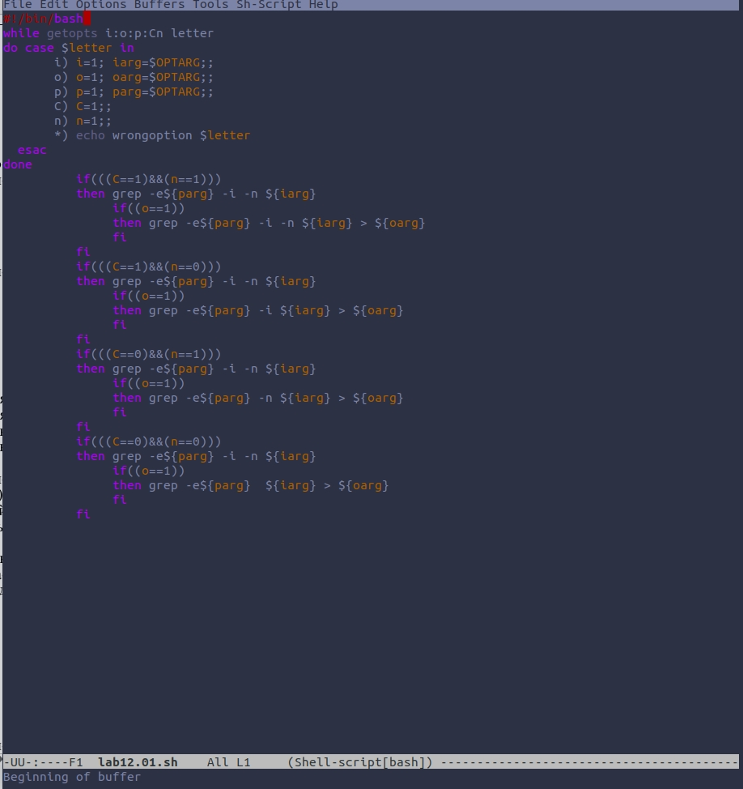
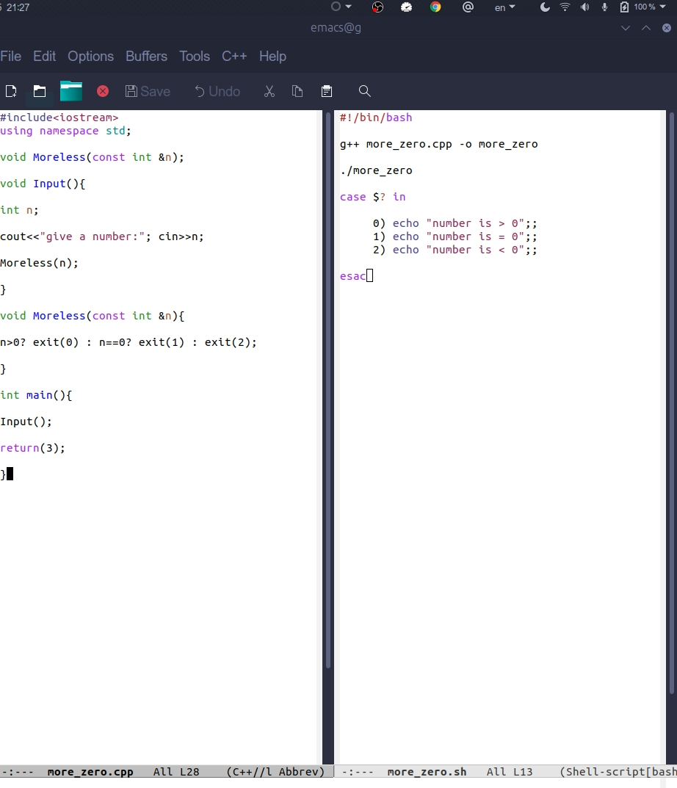
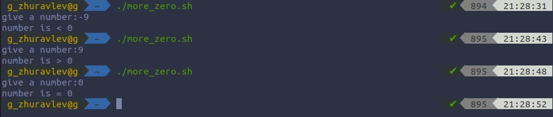
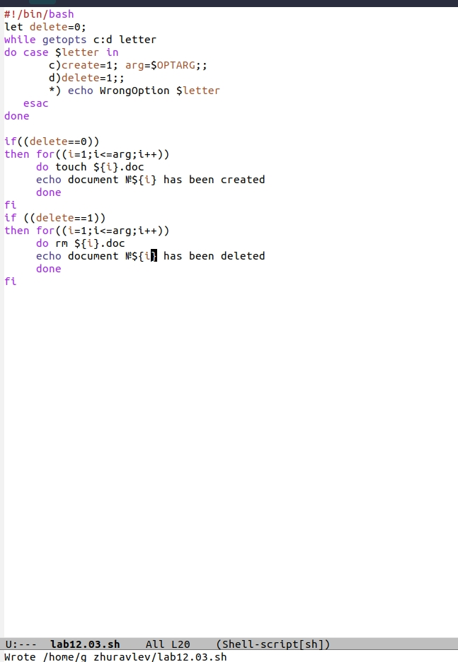
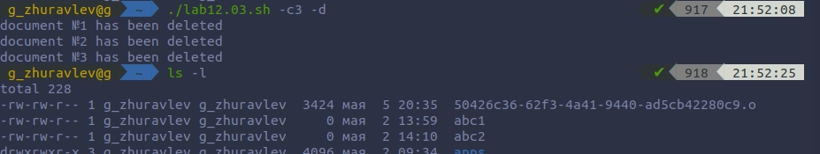
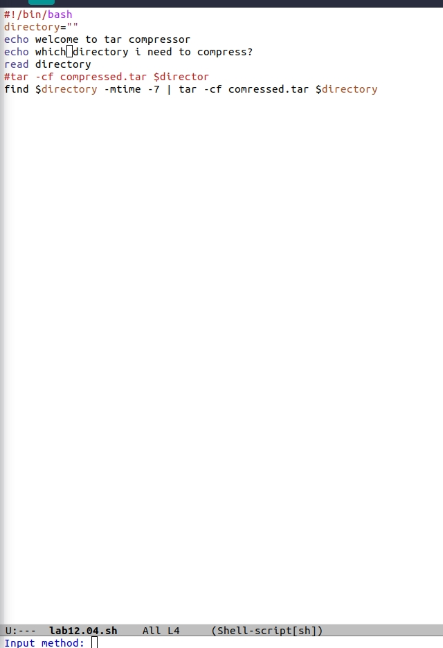
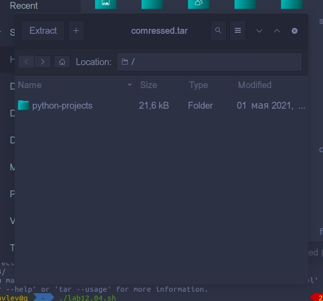

# Цель работы
 Изучить основы программирования в оболочке ОС UNIX, научиться писать более сложные командные файлы с использованием логических управляющих конструкций и циклов.

# Ход работы.

### 1. Используя команды getopts grep, написал командный файл, который анализирует командную строку с ключами:
        – -i — прочитать данные из указанного файла;
        – -o — вывести данные в указанный файл;
        – -p - шаблон — указать шаблон для поиска;
        – -C — различать большие и малые буквы;
        – -n — выдавать номера строк.
        а затем ищет в указанном файле нужные строки, определяемые ключом -p.

### 2. Написал на языке Cpp программу, которая вводит число и определяет, является ли оно больше нуля, меньше нуля или равно нулю. Затем программа завершается с помощью функции exit(n), передавая информацию в о коде завершения в оболочку. Командный файл должен вызывать эту программу и, проанализировав с помощью команды $?, выдать сообщение о том, какое число было введено.

### 3. Написал командный файл, создающий указанное число файлов, пронумерованных последовательно от 1 до i. Число файлов, которые необходимо создать, передаётся в аргументы командной строки. Этот же командный файл должен уметь удалять все созданные им файлы (если они существуют).

### 4. Написал командный файл, который с помощью команды tar запаковывает в архив все файлы в указанной директории. Модифицировал его так, чтобы запаковывались только те файлы, которые были изменены менее недели тому назад (использовал команду find).

# Вывод
Благодаря этой лабараторной работе, я написал некоторые интересные скрипты , которые оказались сложнее предыдущих; развился в сфере взаимодействия с bash.
