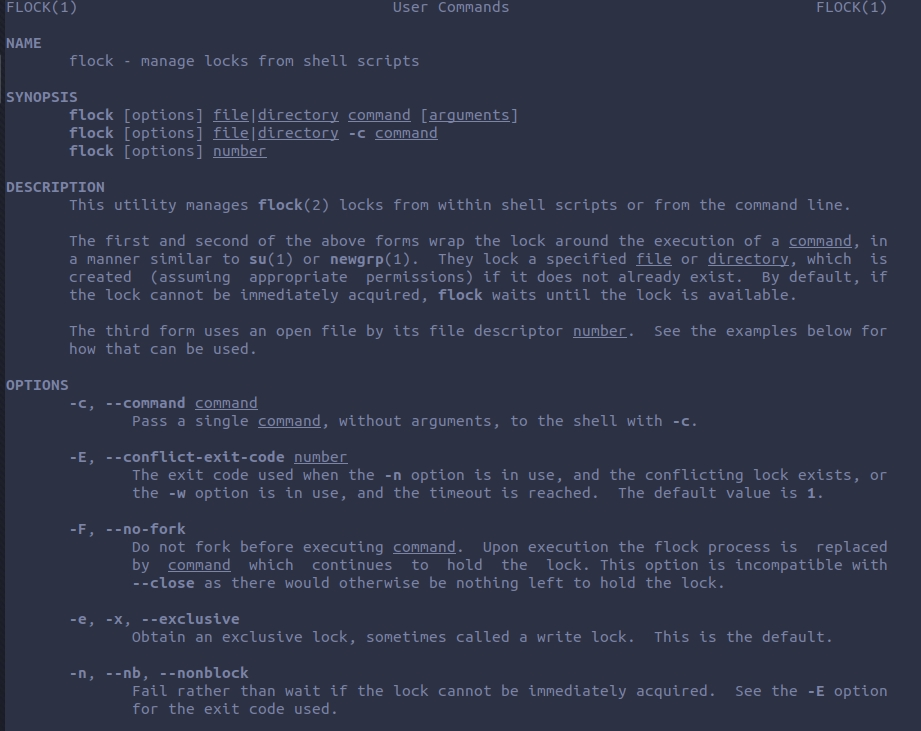
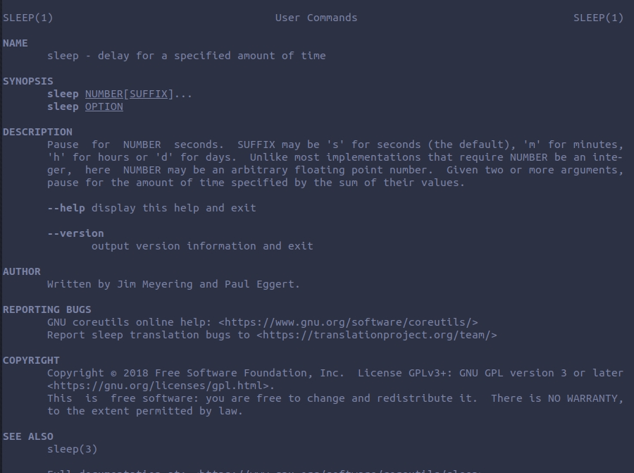
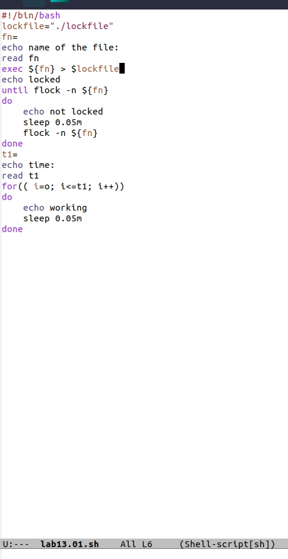
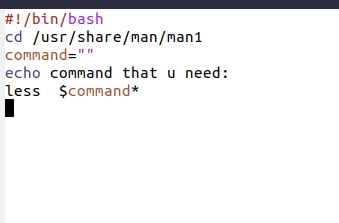
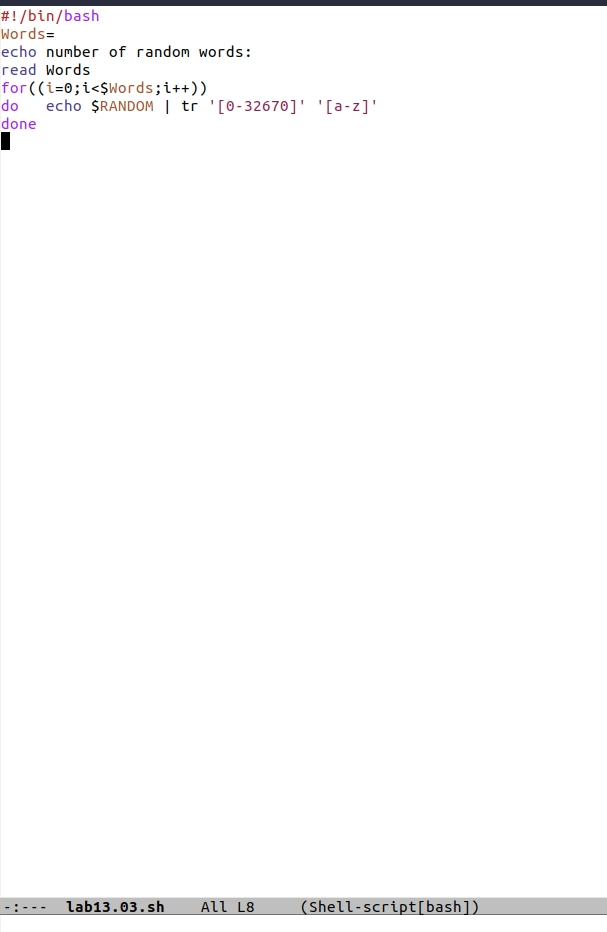
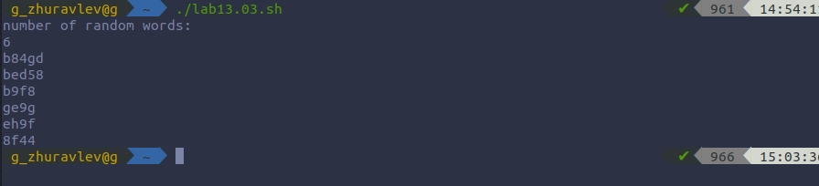

# Цель работы
 изучить основы программирования в оболочке ОС UNIX, научиться писать более сложные командные файлы с использованием логических управляющих конструкций и циклов.

# Ход работы.

### 1. Написал командный файл, реализующий упрощённый механизм семафоров.

### 2. Реализовал команду man с помощью командного файла. Изучил содержимое каталога /usr/share/man/man1.

### 3. Используя встроенную переменную $RANDOM, написал командный файл, генерирующий случайную последовательность букв латинского алфавита. $RANDOM выдаёт псевдослучайные числа в диапазоне от 0 до 32767.

# Вывод.
Благодаря этой лабараторной работе, я написал некоторые интересные скрипты , которые оказались сложнее предыдущих; развился в сфере взаимодействия с bash.
