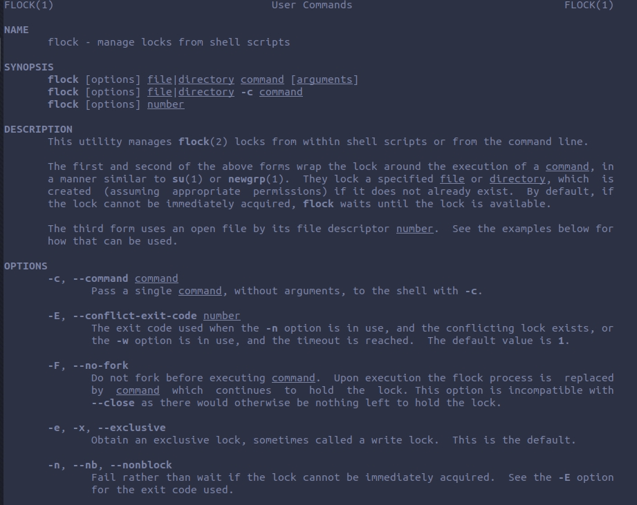
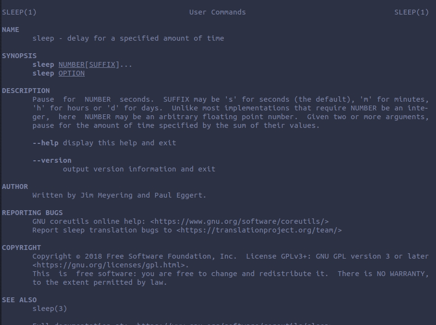
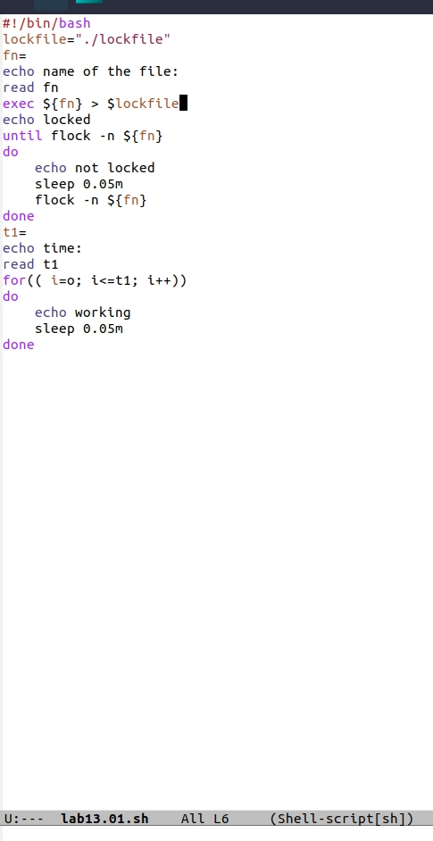
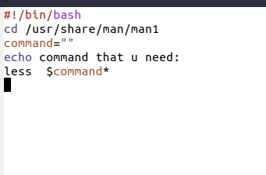
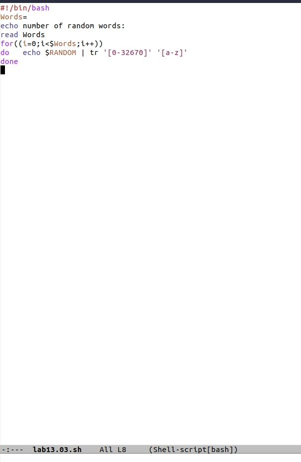
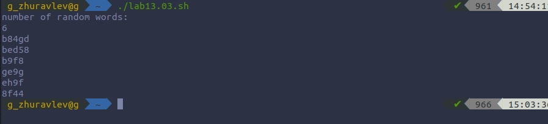

# Цель работы
 изучить основы программирования в оболочке ОС UNIX, научиться писать более сложные командные файлы с использованием логических управляющих конструкций и циклов.

# Ход работы.

### 1. Написал командный файл, реализующий упрощённый механизм семафоров.

### 2. Реализовал команду man с помощью командного файла. Изучил содержимое каталога /usr/share/man/man1.

### 3. Используя встроенную переменную $RANDOM, написал командный файл, генерирующий случайную последовательность букв латинского алфавита. $RANDOM выдаёт псевдослучайные числа в диапазоне от 0 до 32767.

# Вывод.
Благодаря этой лабараторной работе, я написал некоторые интересные скрипты , которые оказались сложнее предыдущих; развился в сфере взаимодействия с bash.

# Контрольные вопросы.

        1. В строке while [$1 != "exit"] квадратные скобки надо заменить на круглые.

        2. пример,
        str1="Goodbye, "
        str2="Moon"
        str3="$str1$str2"
        echo "$str3"

        3. Команда seq выводит последовательность целых или действительных чисел, подходящую для передачи в другие программы. Mожно использовать seq с циклом for.

        4. $((10/3)) = 3;

        5. zsh VS bash

        1. ZSH
            5.1. zmv- поможет массово переименовать файлы/директории.
            5.2. zcalc — это замечательный калькулятор командной строки, удобный способ считать быстро, не покидая терминал.
            5.3. Autopushd позволяет делать popd после того, как с помощью cd, чтобы вернуться в предыдущую директорию.
            5.4. Поддержка для структур данных «хэш».
            5.5. Поддержка чисел с плавающей точкой.

        2. bash
            5.6. Использование опции –rcfile <filename> с bash позволяет исполнять команды из определённого файла.
            5.7. Может быть вызвана командой sh.
            5.8. Mожно запустить в определённом режиме POSIX.
            5.9. Moжно включить в режиме ограниченной оболочки (с rbash или --restricted).
            5.10. Перенаправление вывода с использованием операторов ‘>’, ‘>|’, ‘<>’, ‘>&’, ‘&>’, ‘>>’.

        6. Синтаксис конструкции - верен.

        7.1. Стек большинства тестируемых языков поддерживают только очень ограниченное число рекурсивных вызовов. Некоторые трансляторы (gcc, icc, ...) позволяют увеличить размер стека изменением переменных среды исполнения или параметром.
        7.2. В  bash реализован динамический стек, позволяющий использовать всю память компьютера.
        7.3. Скорость bash кодов x86-64 может меньше, чем аналогичных кодов x86.
        7.4. Скорость компиляции и исполнения программ на яваскрипт в популярных браузерах лишь в 2-3 раза уступает лучшим трансляторам и превосходит даже некоторые качественные компиляторы, более чем в 10 раз обгоняя большинство трансляторов других языков сценариев и подобных им по скорости исполнения программ .
