# Цель работы
приобрести простейшие навыки разработки, анализа, тестирования и отладки приложений в ОС типа UNIX/Linux на примере создания на языке программирования C калькулятора с простейшими функциями.

# Ход работы.
### 1. В домашнем каталоге создал подкаталог ~/work/os/lab_prog.
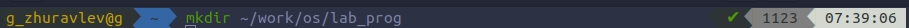

### 2. Создал в нём файлы: CalcHeader.h, Calculator.cpp, operation.cpp, main.cpp.
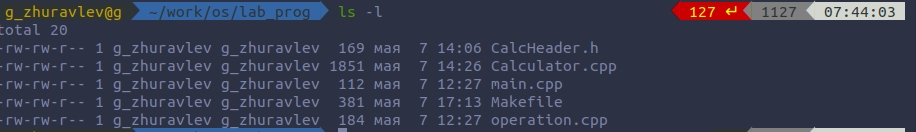

        2.1. Header file.
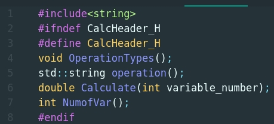

        2.2. Calculator.cpp.
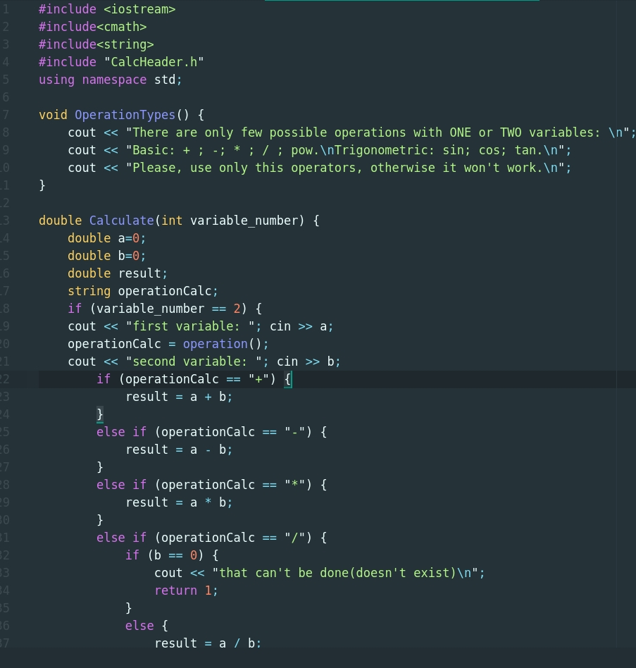
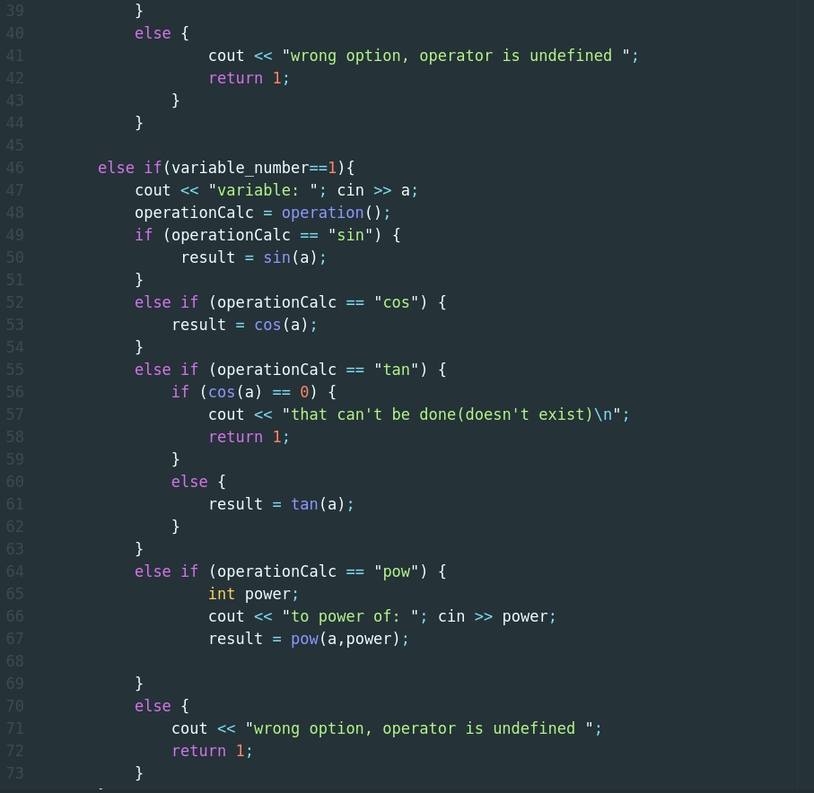
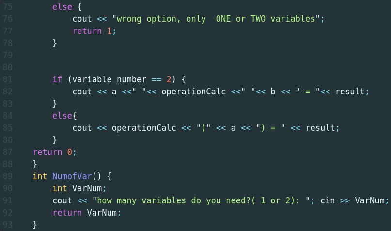

        2.3. operation.cpp.
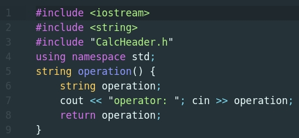

        2.4. main.cpp.
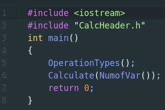

### 3.Выполнил компиляцию программы посредством g++:
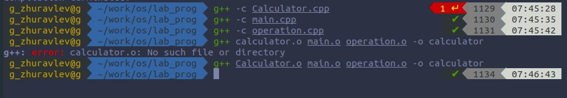

### 4. Создал Makefile.
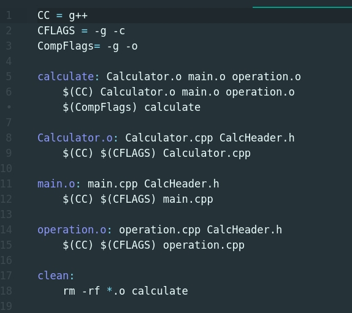

### 5. Собрал Makefile.
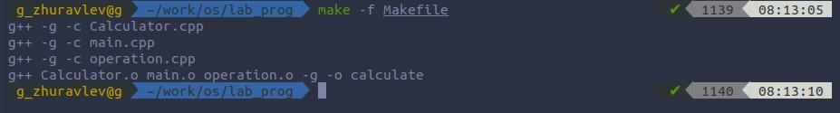

        В нём указаны :
        1. CC - тип компилятора.
        2. CFLAGS - опции, с которыми мы компилируем основной файл.
        3. CompFlags - опции, с которыми мы компилируем остальные файлы.
        4. Компиляция каждого зависящего файла .o
        5. Сборщик всей программы "calculate"
        6. Команда clean, для быстрого удаления всех файлов.

### 5. Провёл отладку с помощью GNUdebbuger(gdb).

        5.1. Запустил отладчик GDB, загрузив в него программу для отладки.
        5.2. Для запуска программы внутри отладчика ввел команду run.
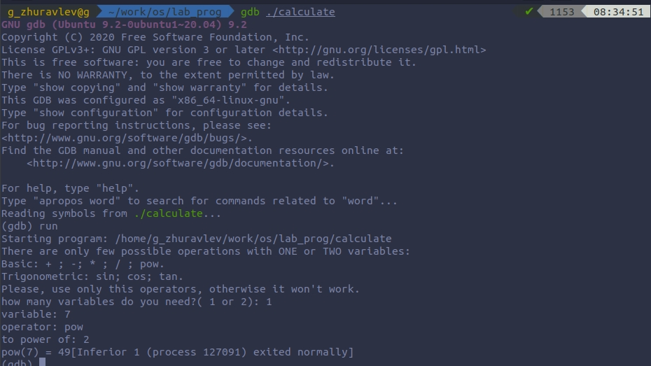        

        5.3. Использовала команду list.
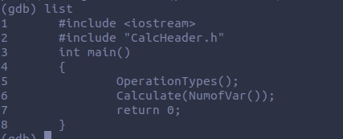

        5.4. Для просмотра строк с 2 по 5 основного файла использовал list 2,5.
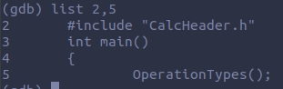

        5.5. Для просмотра определённых строк не основного файла использовал list с параметрами: list Calculator.cpp: 7,45.
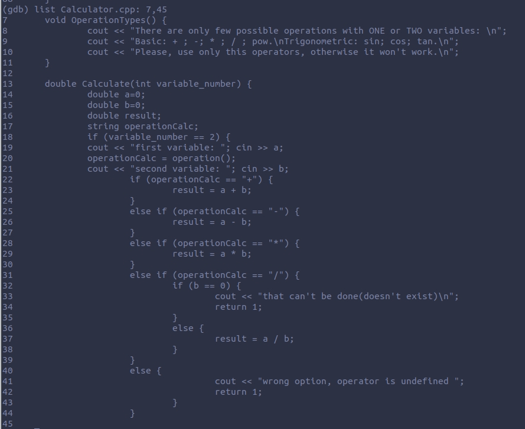

        5.6. Установил точку останова в файле Calculator.cpp на строке номер 18
        5.7. Вывел информацию об имеющихся в проекте точках останова: info breakpoints
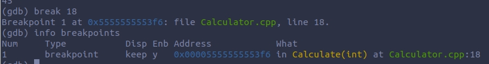

        5.8. Запустил программу внутри отладчика и убедился, что программа остановится в момент прохождения точки останова.
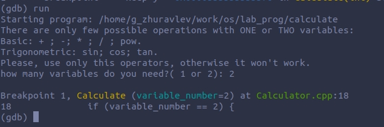

        5.8.1. Использовал backtrace.
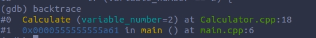

        5.9. Посмотрел, чему равно на этом этапе значение переменной a, введя: print a.
        5.10. Сравнил с результатом вывода на экран после использования команды: display a.    
        5.11. Убрал точки останова: info breakpoints -> delete 1.
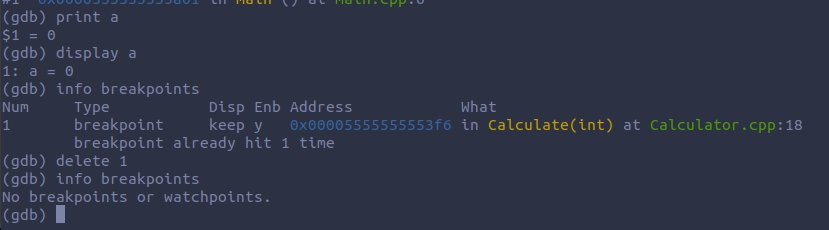
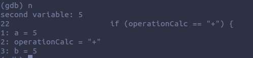

### 6. С помощью утилиты cppcheck проанализировал коды файлов( всю директорию).
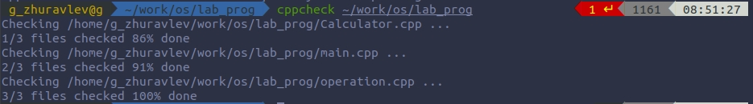

# Вывод.
Благодаря этой лабараторной работе я приобрел простейшие навыки разработки, анализа, тестирования и отладки приложений в ОС типа UNIX/Linux на примере создания на языке программирования C++ калькулятора с простейшими функциями.
