# Цель работы
приобрести простейшие навыки разработки, анализа, тестирования и отладки приложений в ОС типа UNIX/Linux на примере создания на языке программирования C калькулятора с простейшими функциями.

# Ход работы.
### 1. В домашнем каталоге создал подкаталог ~/work/os/lab_prog.
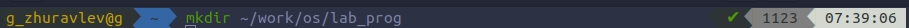

### 2. Создал в нём файлы: CalcHeader.h, Calculator.cpp, operation.cpp, main.cpp.
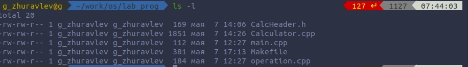

        2.1. Header file.
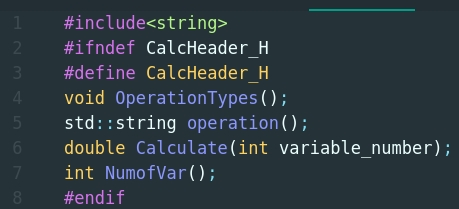

        2.2. Calculator.cpp.
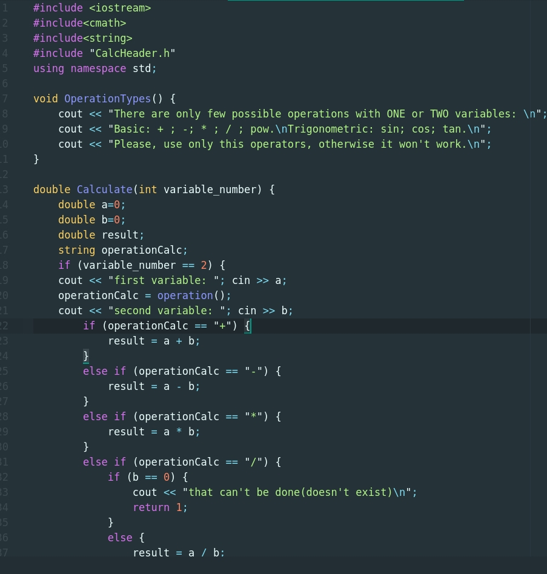
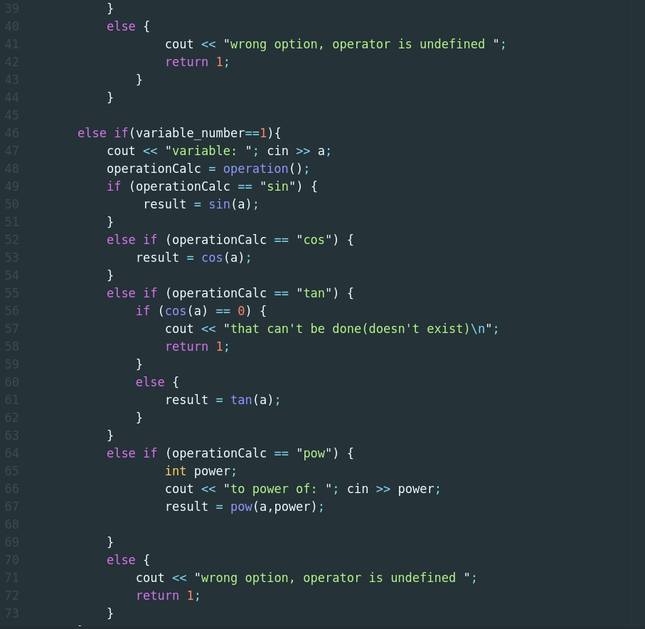
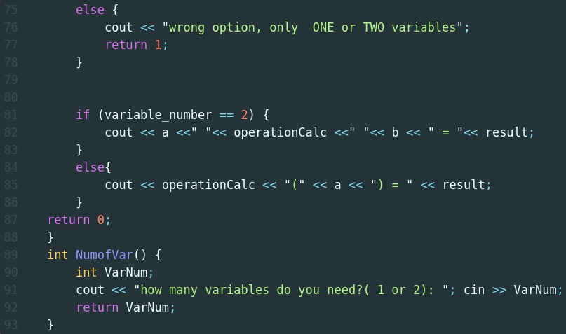

        2.3. operation.cpp.
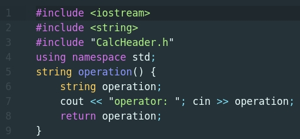

        2.4. main.cpp.
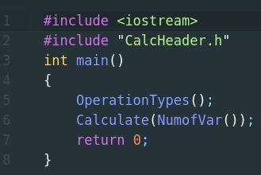

### 3.Выполнил компиляцию программы посредством g++:
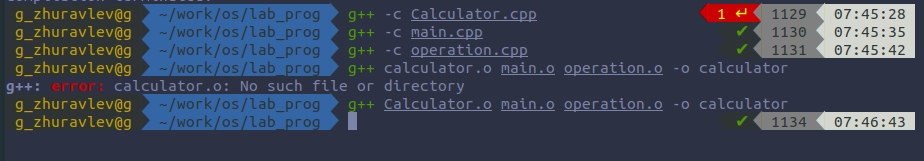

### 4. Создал Makefile.
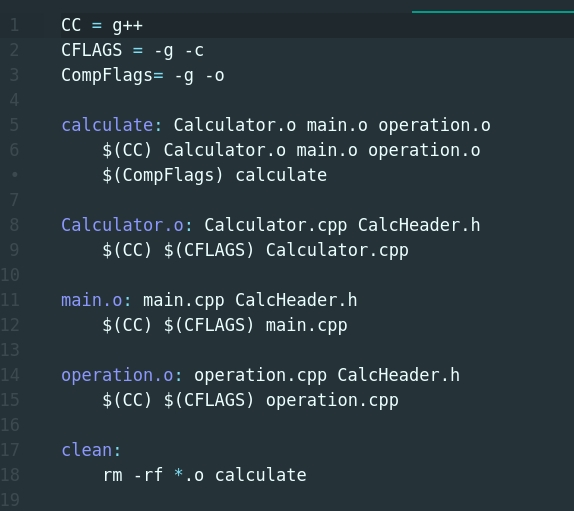

### 5. Собрал Makefile.
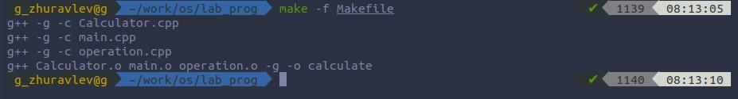

        В нём указаны :
        1. CC - тип компилятора.
        2. CFLAGS - опции, с которыми мы компилируем основной файл.
        3. CompFlags - опции, с которыми мы компилируем остальные файлы.
        4. Компиляция каждого зависящего файла .o
        5. Сборщик всей программы "calculate"
        6. Команда clean, для быстрого удаления всех файлов.

### 5. Провёл отладку с помощью GNUdebbuger(gdb).

        5.1. Запустил отладчик GDB, загрузив в него программу для отладки.
        5.2. Для запуска программы внутри отладчика ввел команду run.
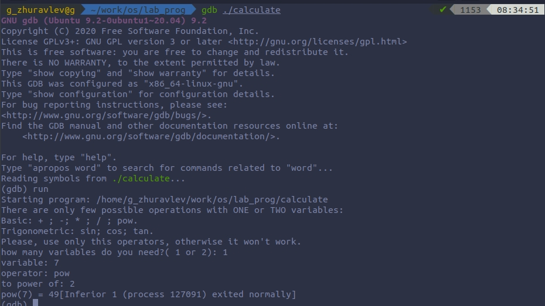        

        5.3. Использовал команду list.
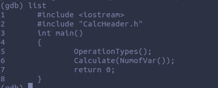

        5.4. Для просмотра строк с 2 по 5 основного файла использовал list 2,5.

        5.5. Для просмотра определённых строк не основного файла использовал list с параметрами: list Calculator.cpp: 7,45.
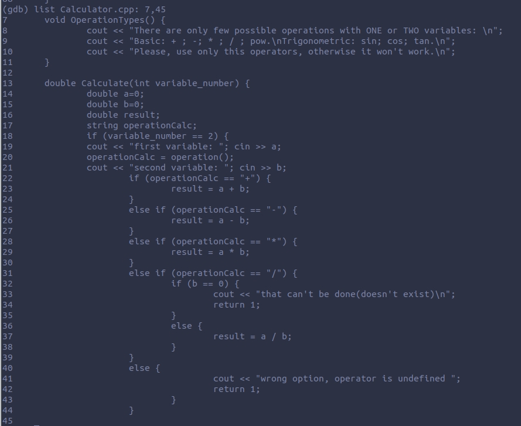

        5.6. Установил точку останова в файле Calculator.cpp на строке номер 18
        5.7. Вывел информацию об имеющихся в проекте точках останова: info breakpoints
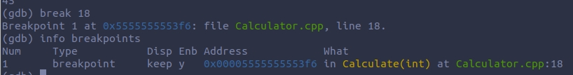

        5.8. Запустил программу внутри отладчика и убедился, что программа остановится в момент прохождения точки останова.
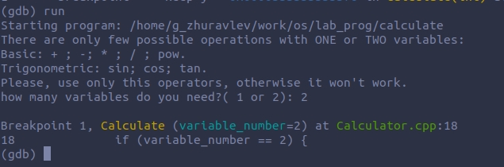

        5.8.1. Использовал backtrace.
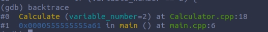

        5.9. Посмотрел, чему равно на этом этапе значение переменной a, введя: print a.
        5.10. Сравнил с результатом вывода на экран после использования команды: display a.    
        5.11. Убрал точки останова: info breakpoints -> delete 1.
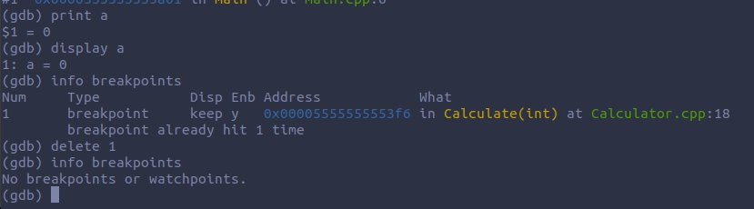

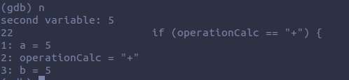

### 6. С помощью утилиты cppcheck проанализировал коды файлов( всю директорию).
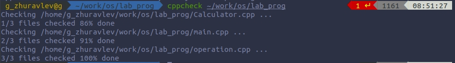

# Вывод.
Благодаря этой лабараторной работе я приобрел простейшие навыки разработки, анализа, тестирования и отладки приложений в ОС типа UNIX/Linux на примере создания на языке программирования C++ калькулятора с простейшими функциями.

# Контрольные вопросы.
        1. Информацию об этих программах можно получить с помощью функций --help и man.

        2. Разработка приложений в UNIX:

            1. создание исходного кода программы;(файл с необходимым расширением(и кодом)).

            2. сохранение различных вариантов исходников;

            3. анализ исходников; необходимо отслеживать изменения исходного кода.

            4. компиляция исходников и построение исполняемого модуля;

            5. тестирование и отладка; (проверка кода на наличие ошибок)

            6. сохранение всех изменений, выполняемых при тестировании и отладке.

            7. Загрузка версии исходников в систему контроля версий GIT.

        3. Суффикс определяет какая компиляция требуется. Суффиксы и префиксы указывают тип объекта.( пример main.c для компиляции на языке C)

        4. Основное назначение этого компилятора заключается в компиляции всей программы и получении исполняемого модуля.

        5. Утилита make нужна для исполнения команд из Makefile(-ов). (компиляции, очистки и тп).

        6. Пример:

        CC = compiler
        CFLAGS = compiler flags( like -c or -g)
        .....( and so on)

        target1: dependencies ( for example: report: dependentFile.o ... dependentFile.o)
        target2: dependencies
        ...
        targetn: dependencies
        <tab>(necessary) $(CC) dependentFile.o $(CFLAGS) report.

        пример из лабараторной работы:

        CC = g++
        CFLAGS = -g -c
        CompFlags= -g -o

        calculate: Calculator.o main.o operation.o
        	$(CC) Calculator.o main.o operation.o $(CompFlags) calculate

        Calculator.o: Calculator.cpp CalcHeader.h
        	$(CC) $(CFLAGS) Calculator.cpp

        main.o: main.cpp CalcHeader.h
        	$(CC) $(CFLAGS) main.cpp

        operation.o: operation.cpp CalcHeader.h
        	$(CC) $(CFLAGS) operation.cpp

        clean:
        	rm -rf *.o calculate

        7. Пошаговая отладка программ заключается в том, что выполняется один оператор программы и, затем контролируются те переменные, на которые должен был воздействовать данный оператор. Если в программе имеются уже отлаженные подпрограммы, то подпрограмму можно рассматривать, как один оператор программы и воспользоваться вторым способом отладки программ. Если в программе существует достаточно большой участок программы, уже отлаженный ранее, то его можно выполнить, не контролируя переменные, на которые он воздействует. Использование точек останова позволяет пропускать уже отлаженную часть программы. Точка останова устанавливается в местах, где необходимо проверить содержимое переменных или просто проконтролировать, передаётся ли управление данному оператору. Практически во всех отладчиках поддерживается это свойство (а также выполнение программы до курсора и выход из подпрограммы). Затем отладка программы продолжается в пошаговом режиме с контролем локальных и глобальных
        переменных, а также внутренних регистров микроконтроллера и напряжений на выводах этой микросхемы.

        8.

            1. backtrace - вывод на экран путь к текущей точке останова.

            2. break - установить точку останова (в качестве параметра может
            быть указан номер строки или название функции)

            3. clear - удалить все точки останова в функции

            4. continue - продолжить выполнение программы

            5. delete (n) - удалить точку останова

            6. display - добавить выражение в список выражений, значения которых отображаются при достижении точки останова программы

            7. finish - выполнить программу до момента выхода из функции

            8. info breakpoints - вывести на экран список используемых точек останова

            9. info watchpoints - вывести на экран список используемых контрольных выражений

            10. list - вывести на экран исходный код (в качестве параметра может быть указано название файла и через двоеточие номера начальной и конечной строк)

            11. next - выполнить программу пошагово, но без выполнения вызываемых в программе функций

            12. print - вывести значение указываемого в качестве параметра выражения

            13. run - запуск программы на выполнение

            14. set[variable] - установить новое значение переменной

            15. step - пошаговое выполнение программы

            16. watch - установить контрольное выражение, при изменении значения которого программа будет остановлена

        9.

            1) Запустил Makefile(компиляция и сборка);

            2) Начал отладку( run);

            3) Вывел содержимое основного файла и Calculator.cpp;

            4) Установил точку останова в Calculator.cpp.

            5) Продолжил выполнение( run);

            6) Посмотрел используемые функции(на данный момент времени  backtrace);

            7) Использовал команды print & display;

            8) Удалил точку останова;

            9) Закончил отладку(ошибок не было найдено);

        10. Реакция была нормальной( ошибок не было)

        11. cppcheck; splint; cscope;

        12.

            1) Проверка корректности задания аргументов всех использованных в программе функций, а также типов возвращаемых ими значений;

            2) Поиск фрагментов исходного текста, корректных с точки зрения синтаксиса языка Си, но малоэффективных с точки зрения их реализации или содержащих в себе семантические ошибки;

            3) Общая оценка мобильности пользовательской программы.
