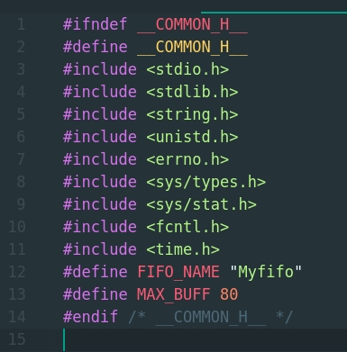
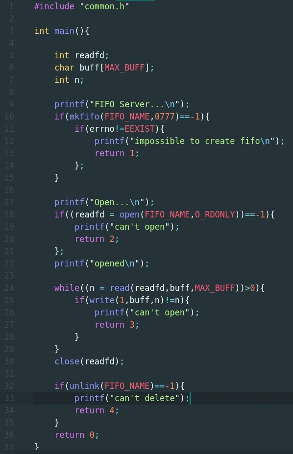
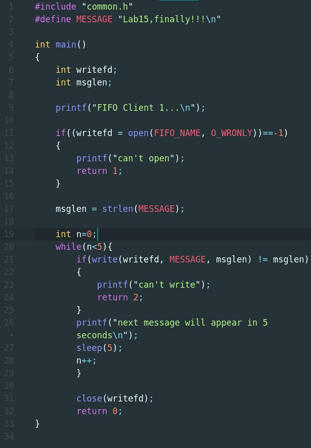
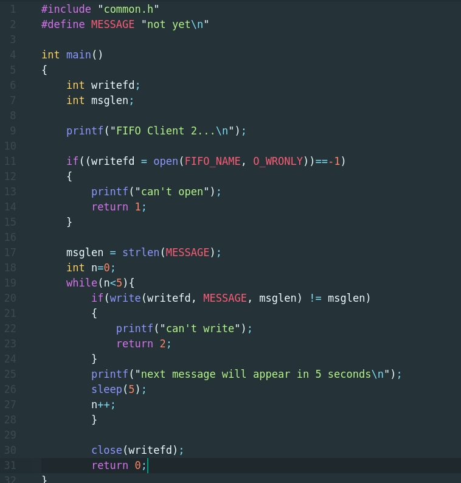
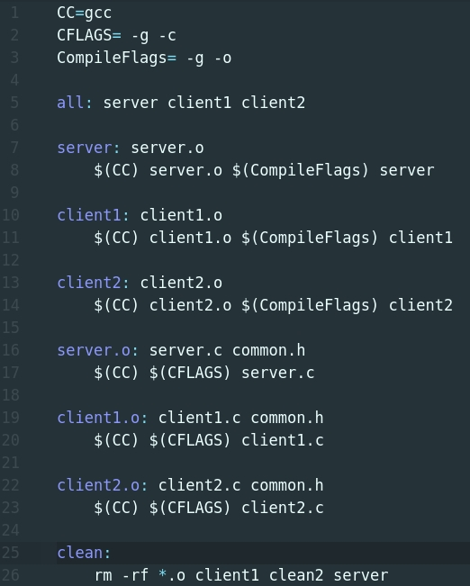
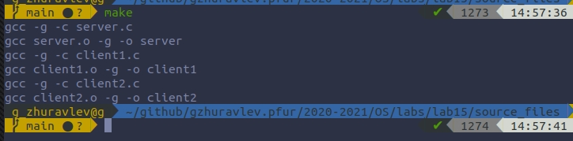
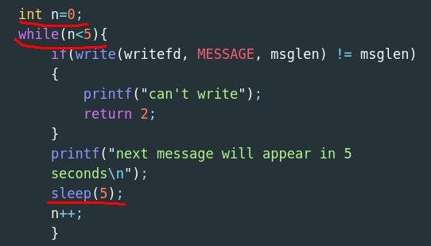
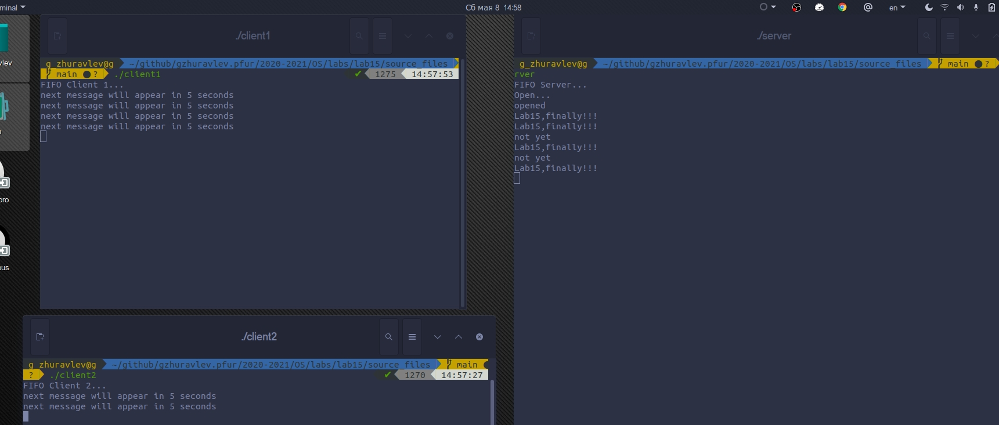
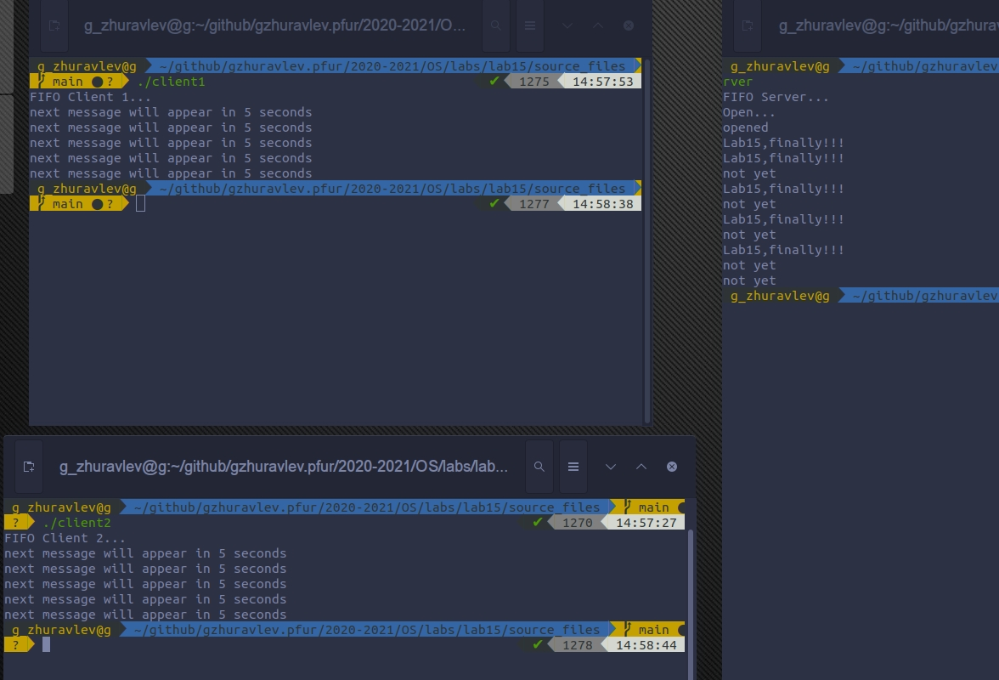

# Цель работы
Приобретение практических навыков работы с именованными каналами
# Ход работы.

### 1. Ознакомился с пограммами и на их основе написал свои, добавил 1 клиент.

        1.1. common.h(header file)

        1.2. server.c.

        1.3. client1.c.

        1.4. client2.c.

        1.5. Makefile

        1.6. Компиляция.
  

### 2. Добавил функцию задержки sleep(5) (сообщение появляется 5 раз)

        2.1. Реализация.

        2.2. В действии.

        2.3. Завершение.

### 3. Что будет в случае, если сервер завершит работу, не закрыв канал?

Ответ: Ошибка.

# Вывод.
Благодаря этой лабораторной работе, я приобрел практические навыки работы с именованными каналами.
