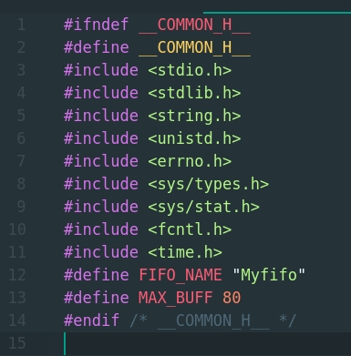
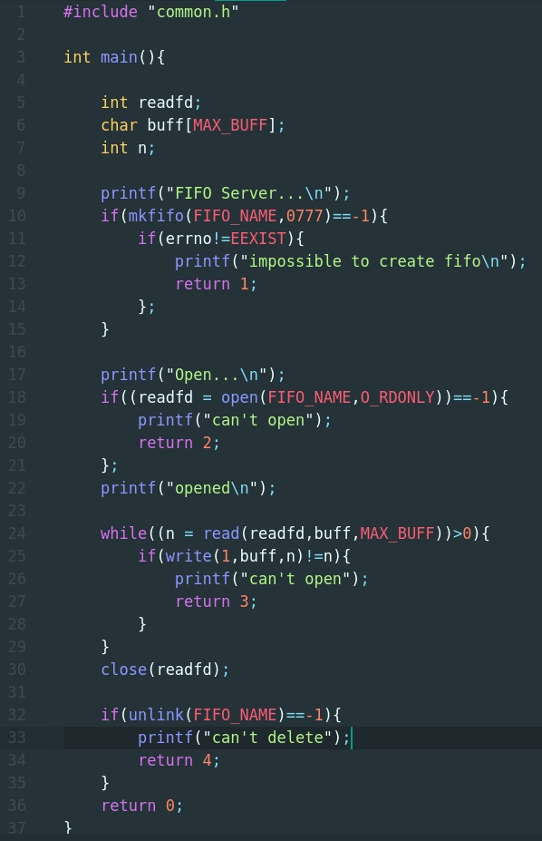
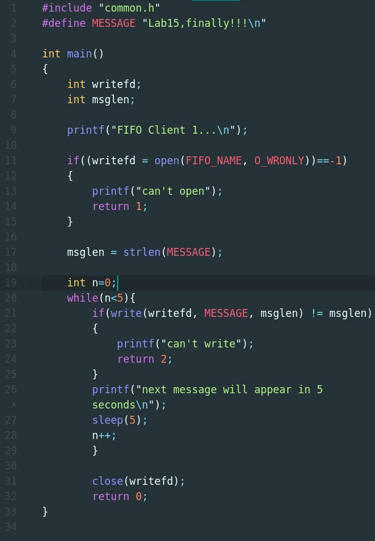
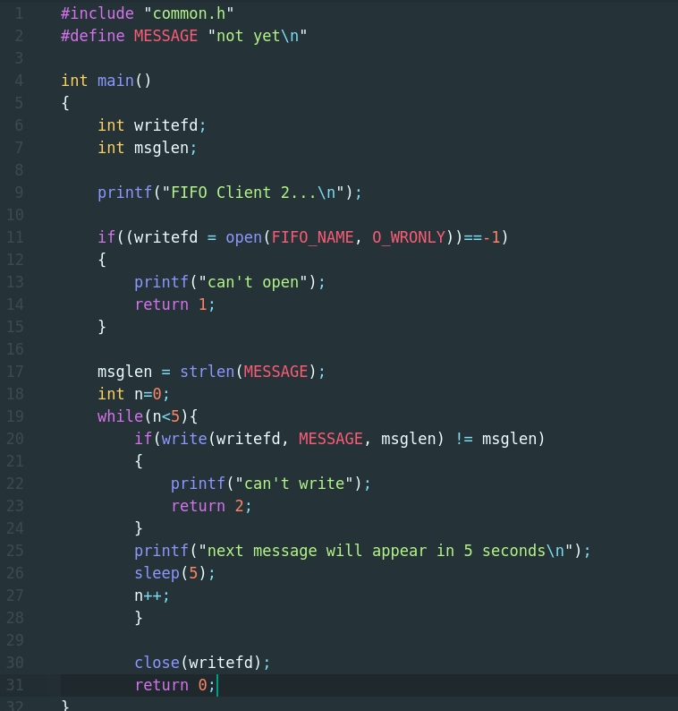
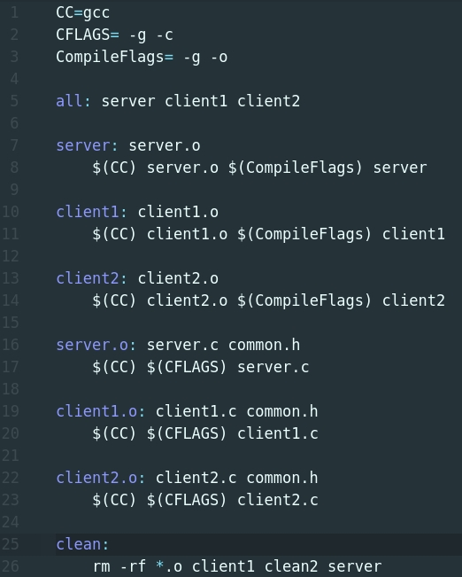
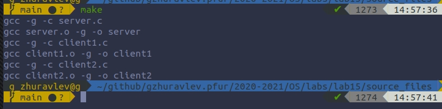
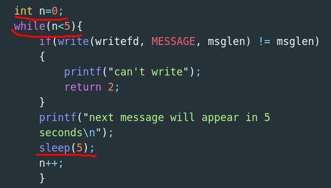
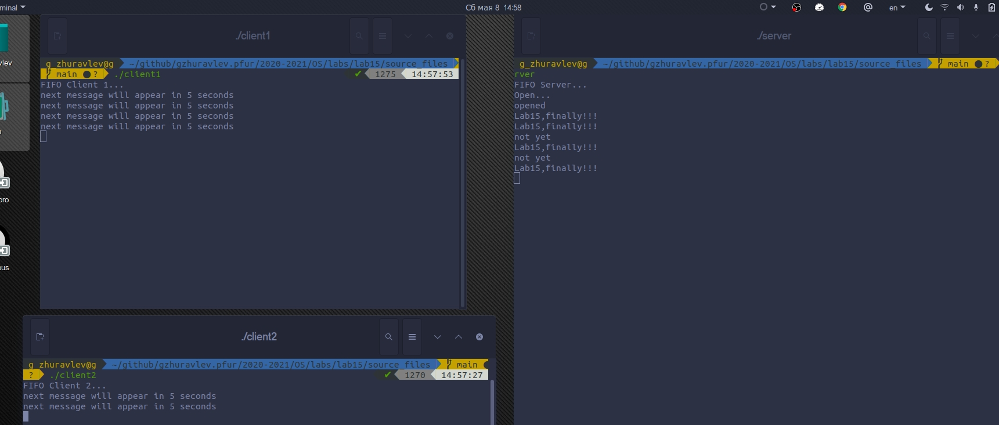
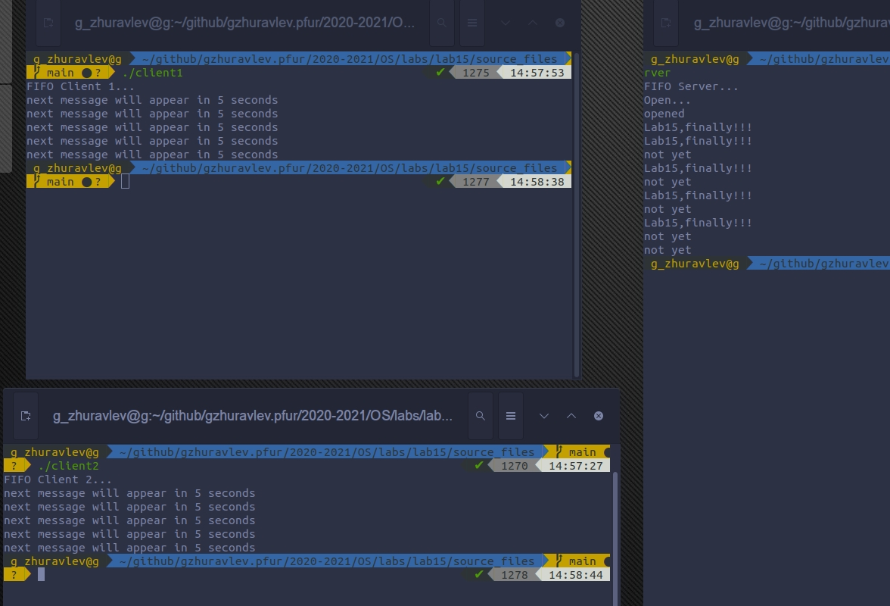

# Цель работы
Приобретение практических навыков работы с именованными каналами
# Ход работы.

### 1. Ознакомился с пограммами и на их основе написал свои, добавил 1 клиент.

        1.1. common.h(header file)

        1.2. server.c.

        1.3. client1.c.

        1.4. client2.c.

        1.5. Makefile

        1.6. Компиляция.
  

### 2. Добавил функцию задержки sleep(5) (сообщение появляется 5 раз)

        2.1. Реализация.

        2.2. В действии.

        2.3. Завершение.

### 3. Что будет в случае, если сервер завершит работу, не закрыв канал?

Ответ: Ошибка.

# Вывод.
Благодаря этой лабораторной работе, я приобрел практические навыки работы с именованными каналами.

# Контрольные вопросы.
        1. Именованные каналы отличаются от не именованных наличием идентификатора канала, который представлен как специальный файл.
        2. нет
        3. да, например с помощью  функции mkfifo(FIFO_NAME,MODE) в терминале.
        4. int pipe(int fd[2]) - 2 файловых дескриптора(чтение и запись).
        5. mkfifo(FIFO_NAME,MODE)
        6. Смотря на пример из лаб15 -> произойдет ошибка при чтении.
        7. Смотря на пример из лаб15 -> произойдет ошибка при записи.
        8. При технологии FIFO да, но это будет неудобно.(лучший вариант - один на чтение, один на запись.)
        9. write имеет следущую логику: write(fd, buffer, count), где buffer - записываемые файлы; count - байты;  fd - file descriptor; ->
        write(1,buff,n) - 1-fd запись(0-чтение, 1-запись); buff- записываемые данные; n - кол-во записываемых данных.
        10. strerror() возвращает указатель на сообщение об ошибке, связанное с номером ошибки.(errno- number of error).
